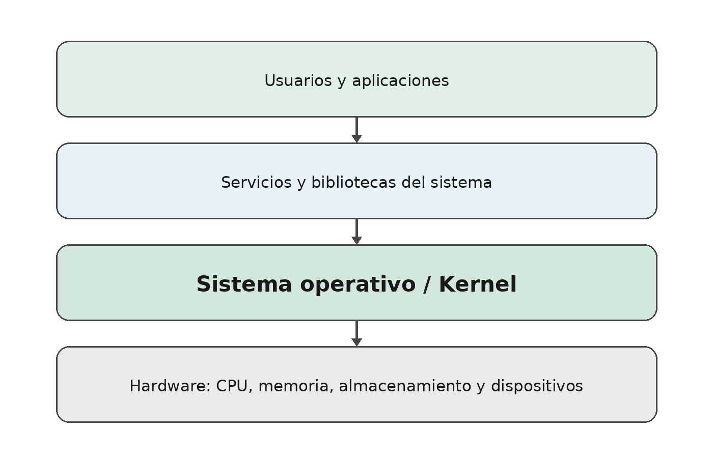
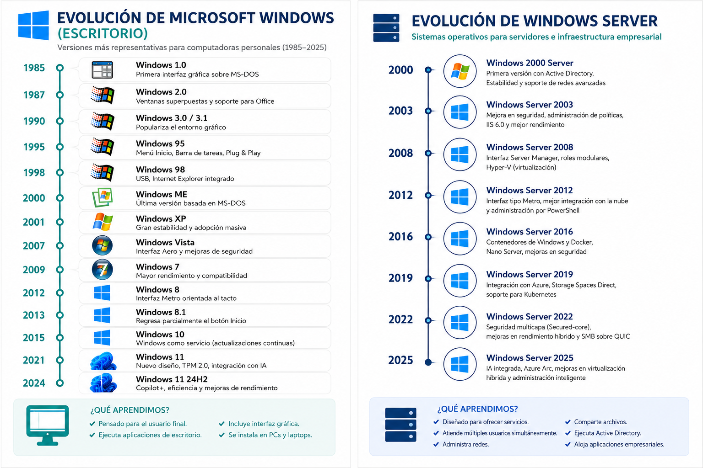
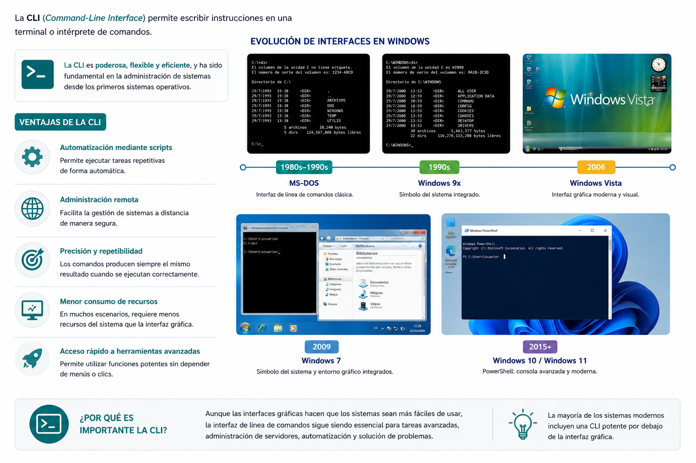
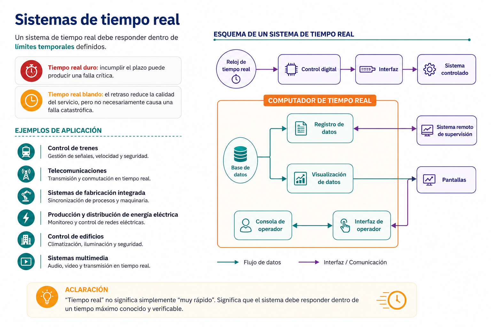

# Presentación de la clase

Bienvenidos al curso de **Sistemas Operativos I**. En esta primera clase estudiaremos el software que coordina prácticamente todo lo que ocurre en una computadora, un teléfono, un servidor o un dispositivo inteligente.

Imagine que enciende su computadora y, en pocos segundos, puede abrir un navegador, reproducir música, guardar archivos, conectarse a Internet y utilizar varios programas al mismo tiempo. Mientras usted observa una pantalla aparentemente sencilla, el equipo está detectando dispositivos, reservando memoria, iniciando servicios, creando procesos, aplicando controles de seguridad y organizando el acceso al almacenamiento.

La pieza que coordina esas actividades es el **sistema operativo**.

::: {.callout-note title="Idea central de la clase"}
El sistema operativo administra recursos, ofrece servicios a los programas y crea un entorno seguro y utilizable para las personas y las aplicaciones.
:::

## Objetivos de aprendizaje

Al finalizar esta clase, el estudiante será capaz de:

- Explicar qué es un sistema operativo y por qué es indispensable.
- Identificar la relación entre usuario, aplicaciones, sistema operativo y hardware.
- Reconocer las funciones principales del sistema operativo.
- Diferenciar una interfaz gráfica de una interfaz de línea de comandos.
- Clasificar sistemas operativos según su propósito y forma de trabajo.
- Explicar, de manera introductoria, qué son el kernel, los procesos y las llamadas al sistema.
- Identificar el sistema operativo, la versión y las características básicas de su propio equipo.

::: {.callout-tip title="El libro que nos hubiera gustado tener"}
En este curso no memorizaremos listas aisladas. Relacionaremos cada concepto con situaciones que un ingeniero encontrará al administrar computadoras, servidores, redes y aplicaciones.
:::

# ¿Qué es un sistema operativo?

Un **sistema operativo** es el software fundamental que administra los recursos de un sistema informático y proporciona servicios comunes para que las aplicaciones puedan ejecutarse.

Actúa como intermediario entre:

- las personas que utilizan el equipo;
- las aplicaciones;
- el hardware;
- y los dispositivos conectados.

Sin un sistema operativo, cada programa tendría que conocer directamente cómo funciona cada modelo de procesador, disco, teclado, tarjeta de red o pantalla. El sistema operativo reduce esa complejidad mediante servicios y abstracciones.

{fig-align="center" width="88%"}

## Una comparación sencilla

Pensemos en un hotel:

- Los **huéspedes** representan a los usuarios y aplicaciones.
- Las **habitaciones, energía, ascensores y servicios** representan los recursos de hardware.
- La **administración del hotel** representa al sistema operativo.

Cada huésped utiliza servicios sin controlar directamente toda la infraestructura. La administración asigna recursos, organiza prioridades, establece reglas y evita conflictos.

::: {.callout-important title="Importante"}
El sistema operativo no es únicamente la apariencia del escritorio. La interfaz gráfica es solo una de sus capas. Debajo de ella existen procesos, controladores, servicios, mecanismos de seguridad y un kernel que trabaja continuamente.
:::

# El kernel: núcleo del sistema operativo

El **kernel** es la parte central del sistema operativo. Se ejecuta con privilegios elevados y controla el acceso a los recursos esenciales del computador.

Entre sus responsabilidades se encuentran:

- planificar el uso del procesador;
- administrar la memoria;
- controlar dispositivos mediante controladores;
- coordinar operaciones de entrada y salida;
- aplicar mecanismos de protección;
- ofrecer servicios a los programas mediante llamadas al sistema.

El kernel no debe confundirse con todo el sistema operativo. Un sistema completo también incluye bibliotecas, utilidades, servicios, herramientas administrativas e interfaces de usuario.

## Modo usuario y modo privilegiado

Los procesadores modernos permiten separar al menos dos niveles de ejecución:

| Nivel | Característica principal | Ejemplo |
|---|---|---|
| Modo usuario | Acceso limitado; las aplicaciones no controlan directamente todo el hardware | Navegador, editor de texto, reproductor |
| Modo kernel o privilegiado | Acceso a operaciones críticas y recursos protegidos | Kernel, controladores y componentes esenciales |

Esta separación evita que un error común en una aplicación tenga acceso irrestricto a toda la memoria o a los dispositivos del sistema.

::: {.callout-warning title="Error común"}
Decir que una aplicación "habla directamente con el hardware" suele ser una simplificación. En la mayoría de los casos, la aplicación solicita servicios al sistema operativo, y este coordina la operación con el hardware.
:::

# Funciones principales de un sistema operativo

## Gestión de procesos

Un **proceso** es un programa en ejecución. El sistema operativo debe decidir:

- qué proceso utiliza el procesador;
- durante cuánto tiempo;
- cuándo se pausa;
- cuándo continúa;
- y cómo se comunica con otros procesos.

Cuando una persona abre un navegador, un editor y una videollamada, el equipo parece ejecutar todo simultáneamente. En realidad, el sistema operativo distribuye el tiempo del procesador entre muchas actividades, aprovechando además los múltiples núcleos de la CPU.

## Gestión de memoria

El sistema operativo asigna memoria a cada proceso y procura que una aplicación no modifique sin autorización la memoria de otra.

También puede utilizar **memoria virtual**, una técnica que permite organizar el espacio de direcciones de los procesos y, cuando es necesario, apoyar temporalmente la memoria física con almacenamiento secundario.

## Gestión de archivos y almacenamiento

El sistema operativo organiza la información mediante archivos, carpetas, permisos y sistemas de archivos.

Entre sus tareas se encuentran:

- crear, leer, modificar y eliminar archivos;
- organizar directorios;
- controlar permisos;
- registrar ubicaciones y metadatos;
- coordinar el uso de discos, memorias USB y otras unidades.

## Gestión de dispositivos

Los dispositivos poseen características distintas. Para utilizarlos, el sistema operativo emplea **controladores** o *drivers*.

Un controlador traduce solicitudes generales del sistema a operaciones específicas del dispositivo. Gracias a esta capa, una aplicación puede imprimir sin conocer todos los detalles internos de cada impresora.

## Seguridad y protección

El sistema operativo administra usuarios, sesiones, permisos, credenciales y aislamiento entre procesos.

La seguridad no consiste únicamente en utilizar una contraseña. También incluye:

- controlar quién puede acceder a un archivo;
- limitar privilegios;
- proteger la memoria;
- aplicar actualizaciones;
- registrar eventos;
- bloquear operaciones no autorizadas.

## Redes y comunicación

Los sistemas operativos modernos incluyen una pila de red que permite utilizar protocolos, interfaces, puertos y servicios de comunicación.

Cuando un navegador accede a una página web, el sistema operativo participa en la resolución de nombres, el envío de paquetes, la recepción de información y la entrega de datos a la aplicación correspondiente.

::: {.callout-tip title="En la práctica profesional"}
Cuando un servidor deja de responder, un administrador no debería comenzar reinstalando el sistema operativo. Primero revisa el uso de CPU, memoria, disco, red, procesos y registros para identificar la causa del problema.
:::

# Breve evolución de los sistemas operativos

La evolución de los sistemas operativos está estrechamente relacionada con la evolución del hardware y las necesidades de los usuarios.

## Primeras computadoras

En las primeras generaciones, los programas se cargaban manualmente y el operador controlaba gran parte del proceso. El tiempo de la computadora era costoso y se perdía mucho tiempo preparando cada trabajo.

## Monitor residente

El **monitor residente** permanecía en memoria y automatizaba parte de la carga y ejecución de programas. Fue un paso inicial hacia la coordinación automática de trabajos.

## Procesamiento por lotes

El procesamiento por lotes agrupó varios trabajos para ejecutarlos secuencialmente con poca interacción humana. Esta modalidad mejoró la utilización del equipo, aunque el usuario debía esperar para recibir resultados.

## Multiprogramación y tiempo compartido

La multiprogramación permitió mantener varios trabajos en memoria y utilizar el procesador mientras otro esperaba una operación de entrada o salida.

El tiempo compartido extendió esta idea para atender a varios usuarios de forma interactiva, ofreciendo la impresión de que cada uno disponía del sistema.

## Computadoras personales e interfaces gráficas

Las computadoras personales acercaron la informática a hogares y oficinas. Las interfaces gráficas facilitaron el uso mediante ventanas, iconos, menús y dispositivos apuntadores.

## Internet, dispositivos móviles, nube y virtualización

Los sistemas actuales ya no se limitan a una computadora de escritorio. Existen sistemas para:

- servidores físicos y virtuales;
- teléfonos y tabletas;
- dispositivos integrados;
- infraestructura en la nube;
- vehículos y equipos industriales;
- plataformas de contenedores.

::: {.callout-note title="Perspectiva histórica"}
Los sistemas antiguos como MS-DOS, Windows XP o las primeras versiones de Mac OS siguen siendo importantes para comprender la evolución, pero no deben presentarse como el panorama tecnológico actual.
:::

# Panorama actual de sistemas operativos

La siguiente tabla presenta familias relevantes para un estudiante de Ingeniería en Sistemas.

| Familia | Uso frecuente | Característica general |
|---|---|---|
| Windows | Equipos personales, organizaciones y estaciones de trabajo | Amplio ecosistema comercial y compatibilidad de aplicaciones |
| Windows Server | Servidores empresariales | Servicios de red, identidades, virtualización y administración centralizada |
| GNU/Linux | Servidores, nube, desarrollo, escritorio, supercomputación y sistemas integrados | Código abierto, variedad de distribuciones y gran capacidad de automatización |
| macOS | Computadoras Mac | Integración estrecha entre hardware y software de Apple |
| Android | Teléfonos, tabletas, televisores y dispositivos | Plataforma móvil basada en el kernel Linux |
| iOS/iPadOS | iPhone y iPad | Integración con el ecosistema y hardware de Apple |
| Sistemas de tiempo real | Industria, vehículos, telecomunicaciones y control | Respuesta predecible dentro de límites temporales |

## Windows y Windows Server

A julio de 2026, Windows 11 continúa como la familia principal de escritorio de Microsoft. Microsoft mantiene información oficial de versiones y canales de actualización en su portal de salud de versiones. Windows Server 2025 es la versión LTSC vigente de la plataforma de servidores y se orienta a seguridad, virtualización, almacenamiento e integración híbrida.

La línea de tiempo incluida en el material original muestra parte de la evolución de Windows. Se conserva como referencia histórica, pero debe leerse junto con la información actualizada de esta sección.

{fig-align="center" width="82%"}

## GNU/Linux

Linux es el kernel iniciado por Linus Torvalds. Cuando se combina con herramientas, bibliotecas, gestores de paquetes y entornos de usuario, forma sistemas completos distribuidos en variantes como Ubuntu, Debian, Fedora, Rocky Linux, AlmaLinux o Arch Linux.

Ubuntu 24.04 LTS continúa siendo una versión de soporte prolongado ampliamente utilizada. Las versiones LTS priorizan estabilidad y mantenimiento extendido, una característica valiosa en organizaciones y servidores.

::: {.callout-important title="Precisión terminológica"}
Linux es técnicamente el kernel. En el uso cotidiano se habla de "sistema operativo Linux", pero una expresión más precisa para muchas distribuciones es GNU/Linux o simplemente el nombre de la distribución: Ubuntu, Debian, Fedora, etc.
:::

## macOS

macOS es el sistema operativo de las computadoras Mac. A julio de 2026, macOS Tahoe 26 es la versión estable con actualizaciones de seguridad publicadas por Apple; macOS 27 se encuentra anunciado o en ciclo previo a su disponibilidad general según el momento de consulta.

Para un libro reutilizable es preferible enseñar la familia, su arquitectura general y sus herramientas, en lugar de depender únicamente del número de versión.

## Android e iOS

Android domina una gran variedad de dispositivos móviles y utiliza el kernel Linux como base, aunque su entorno de aplicaciones y servicios es diferente al de una distribución GNU/Linux de escritorio.

Android 17 fue publicado en junio de 2026. En el ecosistema Apple, iOS 26 continúa como versión estable con actualizaciones de seguridad, mientras iOS 27 fue anunciado para una etapa posterior.

::: {.callout-tip title="Consejo del Ingeniero"}
Las versiones cambian con rapidez. En la práctica profesional, siempre consulte la documentación oficial antes de planificar una instalación, una actualización o una migración.
:::

# Interfaces de usuario

Una interfaz permite que una persona interactúe con el sistema operativo.

## Interfaz gráfica de usuario

La **GUI** (*Graphical User Interface*) utiliza ventanas, iconos, menús, botones y otros elementos visuales.

Sus ventajas incluyen:

- facilidad de aprendizaje;
- descubrimiento visual de opciones;
- interacción mediante mouse, pantalla táctil o teclado;
- buena experiencia para tareas generales.

## Interfaz de línea de comandos

La **CLI** (*Command-Line Interface*) permite escribir instrucciones en una terminal o intérprete de comandos.

Entre sus ventajas se encuentran:

- automatización mediante scripts;
- administración remota;
- precisión y repetibilidad;
- menor consumo de recursos en muchos escenarios;
- acceso rápido a herramientas avanzadas.

{fig-align="center" width="85%"}

## No son enemigas

GUI y CLI no deben verse como opciones excluyentes. Un profesional utiliza ambas según la tarea.

| Situación | Interfaz conveniente |
|---|---|
| Configurar una opción ocasional | GUI |
| Repetir la misma tarea en 100 equipos | CLI y automatización |
| Explorar visualmente archivos | GUI |
| Administrar un servidor remoto | CLI |
| Analizar procesos rápidamente | GUI o CLI, según el contexto |

::: {.callout-tip title="En la práctica profesional"}
PowerShell, Bash y otras shells permiten convertir procedimientos manuales en scripts repetibles. Esa capacidad reduce errores y facilita administrar muchos equipos.
:::

# Clasificación de los sistemas operativos

Un sistema operativo puede pertenecer a varias categorías al mismo tiempo.

## Monotarea y multitarea

- **Monotarea:** ejecuta una tarea principal a la vez.
- **Multitarea:** administra varios procesos concurrentes y distribuye recursos entre ellos.

Los sistemas generales actuales son multitarea.

## Monousuario y multiusuario

- **Monousuario:** está diseñado principalmente para una sesión o usuario a la vez.
- **Multiusuario:** permite atender varios usuarios y separar recursos, permisos y sesiones.

Un servidor Linux o Windows Server puede atender múltiples usuarios y servicios simultáneamente.

## Procesamiento por lotes

Ejecuta conjuntos de trabajos con poca interacción durante el procesamiento. Sigue siendo útil en tareas como generación nocturna de reportes, respaldo de información o procesamiento masivo de datos.

## Tiempo compartido

Distribuye el tiempo de CPU entre múltiples usuarios o procesos interactivos, proporcionando respuestas suficientemente rápidas para mantener la sensación de atención individual.

## Sistemas de red y distribuidos

Un sistema operativo de red facilita compartir servicios y recursos entre equipos conectados. Un sistema distribuido coordina componentes ubicados en diferentes nodos para ofrecer un servicio integrado.

## Sistemas de tiempo real

Un sistema de tiempo real debe responder dentro de límites temporales definidos.

- **Tiempo real duro:** incumplir el plazo puede producir una falla crítica.
- **Tiempo real blando:** el retraso reduce la calidad del servicio, pero no necesariamente causa una falla catastrófica.

Ejemplos:

- control industrial;
- sistemas automotrices;
- telecomunicaciones;
- robótica;
- instrumentación médica;
- control de energía.

{fig-align="center" width="72%"}

::: {.callout-warning title="Aclaración"}
"Tiempo real" no significa simplemente "muy rápido". Significa que el sistema debe responder dentro de un tiempo máximo conocido y verificable.
:::

# Llamadas al sistema

Las aplicaciones necesitan solicitar servicios al kernel. Para hacerlo utilizan **llamadas al sistema**.

Algunos servicios típicos son:

- abrir o cerrar un archivo;
- crear un proceso;
- reservar memoria;
- comunicarse por red;
- leer datos de un dispositivo;
- consultar la hora del sistema.

```{mermaid}
flowchart LR
    A[Aplicación] --> B[Biblioteca o API]
    B --> C[Llamada al sistema]
    C --> D[Kernel]
    D --> E[Hardware o recurso]
    E --> D
    D --> B
    B --> A
```

## Bibliotecas y API

Los lenguajes de alto nivel suelen utilizar bibliotecas que presentan funciones más sencillas. La biblioteca prepara los parámetros y realiza la transición necesaria para solicitar el servicio al sistema operativo.

Por ejemplo, una aplicación puede llamar una función para abrir un archivo. Esa función termina utilizando servicios del sistema operativo para validar permisos, localizar el archivo y coordinar el acceso al almacenamiento.

::: {.callout-note title="Observe"}
Las llamadas al sistema forman una frontera controlada entre las aplicaciones y el kernel. Esta frontera permite ofrecer servicios sin entregar a cada programa control total sobre el equipo.
:::

# Relación con la arquitectura del computador

Para comprender un sistema operativo también necesitamos recordar los componentes básicos del computador.

## CPU

La **unidad central de procesamiento** ejecuta instrucciones y realiza operaciones aritméticas, lógicas y de control.

En sistemas modernos, una CPU puede incluir varios núcleos, memorias caché y mecanismos especializados. El sistema operativo planifica procesos e hilos para aprovechar esos recursos.

## Memoria principal

La memoria RAM almacena temporalmente instrucciones y datos necesarios durante la ejecución.

Es rápida, pero normalmente pierde su contenido al apagar el equipo. El sistema operativo administra qué regiones utiliza cada proceso y coordina la memoria virtual.

## Almacenamiento secundario

SSD, discos duros y otros medios conservan información de forma persistente. Son más lentos que la RAM, pero poseen mayor capacidad.

## Unidad de control y ALU

La unidad de control coordina la ejecución de instrucciones dentro del procesador. La unidad aritmética y lógica realiza operaciones matemáticas y comparaciones.

En cursos modernos estos componentes se estudian como partes de la arquitectura del procesador, mientras el sistema operativo se analiza como el software que administra su utilización.

## Periféricos y entrada/salida

Teclado, mouse, pantalla, almacenamiento, impresoras y adaptadores de red intercambian información con el sistema mediante controladores y mecanismos de entrada/salida.

::: {.callout-tip title="Consejo del Ingeniero"}
Cuando una computadora está lenta, no asuma inmediatamente que "la CPU está mala". El cuello de botella puede encontrarse en memoria, almacenamiento, red, temperatura, controladores o en un proceso específico.
:::

# Virtualización y contenedores: una mirada actual

La virtualización permite ejecutar máquinas virtuales con su propio sistema operativo sobre un hipervisor.

Una máquina virtual normalmente incluye:

- un sistema operativo invitado;
- su propio kernel;
- memoria virtual asignada;
- dispositivos virtuales.

Los contenedores aíslan procesos y sus dependencias, pero comparten el kernel del sistema anfitrión. Por eso suelen ser más ligeros que una máquina virtual completa.

| Característica | Máquina virtual | Contenedor |
|---|---|---|
| Kernel propio | Sí | Generalmente no; comparte el kernel anfitrión |
| Aislamiento | Alto | A nivel de procesos y recursos |
| Tamaño | Mayor | Menor |
| Inicio | Más lento | Habitualmente rápido |
| Uso típico | Sistemas completos, pruebas de SO, aislamiento fuerte | Empaquetado y despliegue de aplicaciones |

::: {.callout-note title="Primera aproximación"}
Virtualización y contenedores se estudiarán con mayor profundidad más adelante. En esta clase basta comprender que ambos dependen de funciones esenciales del sistema operativo.
:::

# Laboratorio 1: conozca su sistema operativo

## Propósito

Identificar el sistema operativo del equipo y relacionar los conceptos estudiados con información real.

## Actividad A: información general

Registre los siguientes datos:

| Dato | Resultado de su equipo |
|---|---|
| Sistema operativo | |
| Edición o distribución | |
| Versión | |
| Arquitectura | |
| Procesador | |
| Memoria RAM | |
| Nombre del equipo | |
| Usuario actual | |
| Espacio disponible | |

## Actividad B: Windows

Abra **Terminal**, **PowerShell** o **Símbolo del sistema** y ejecute:

```powershell
systeminfo
```

También puede utilizar:

```powershell
Get-ComputerInfo
```

Comandos básicos seguros para explorar:

```powershell
hostname
whoami
Get-Location
Get-ChildItem
```

Responda:

1. ¿Qué versión y compilación de Windows utiliza?
2. ¿Cuánta memoria física aparece instalada?
3. ¿Cuál es el nombre del equipo?
4. ¿Qué diferencia observa entre `Get-ChildItem` y la vista del Explorador de archivos?

## Actividad C: macOS

Abra **Terminal** y ejecute:

```bash
sw_vers
uname -a
whoami
hostname
pwd
ls
system_profiler SPHardwareDataType
```

Responda:

1. ¿Qué versión de macOS utiliza?
2. ¿Qué arquitectura reporta el equipo?
3. ¿Qué información muestra `pwd`?
4. ¿Qué relación encuentra entre Finder y `ls`?

## Actividad D: GNU/Linux

Abra una terminal y ejecute:

```bash
cat /etc/os-release
uname -r
hostnamectl
whoami
pwd
ls
```

Responda:

1. ¿Cuál es la distribución?
2. ¿Qué versión del kernel utiliza?
3. ¿Qué arquitectura tiene el equipo?
4. ¿Qué información proporciona `/etc/os-release`?

## Actividad E: comparación

Complete la tabla:

| Acción | Windows | macOS/Linux |
|---|---|---|
| Mostrar usuario | `whoami` | `whoami` |
| Mostrar nombre del equipo | `hostname` | `hostname` |
| Mostrar carpeta actual | `Get-Location` | `pwd` |
| Listar archivos | `Get-ChildItem` | `ls` |
| Información del sistema | `systeminfo` | `sw_vers`, `hostnamectl` o `/etc/os-release` |

::: {.callout-warning title="Regla del laboratorio"}
Ejecute únicamente los comandos indicados y lea su salida. No modifique usuarios, permisos, particiones, fecha, hora ni configuraciones del sistema durante esta práctica.
:::

# Caso de análisis

Una empresa posee:

- 40 computadoras de oficina;
- un servidor de archivos;
- una aplicación web;
- teléfonos utilizados por personal de campo;
- un sistema industrial que debe responder en milisegundos.

Analice qué tipo de sistema operativo podría utilizarse en cada contexto y justifique su respuesta considerando:

- propósito;
- seguridad;
- administración;
- interfaz;
- tiempo de respuesta;
- compatibilidad de aplicaciones.

# Resumen de la clase

En esta clase aprendimos que:

- El sistema operativo administra hardware y ofrece servicios a las aplicaciones.
- El kernel es el núcleo privilegiado del sistema.
- Los procesos, la memoria, los archivos, los dispositivos, la seguridad y la red son recursos administrados por el sistema operativo.
- GUI y CLI son formas complementarias de interacción.
- Los sistemas operativos pueden clasificarse por su número de tareas, usuarios, forma de procesamiento y requisitos temporales.
- Las llamadas al sistema permiten a las aplicaciones solicitar servicios al kernel.
- Windows, GNU/Linux, macOS, Android, iOS y los sistemas de tiempo real responden a necesidades distintas.
- La virtualización y los contenedores dependen de capacidades fundamentales del sistema operativo.

::: {.callout-tip title="Consejo final del Ingeniero"}
Un buen administrador no memoriza únicamente comandos. Comprende qué recurso está observando, qué problema intenta resolver y qué efecto tendrá cada acción.
:::

# Tarea sugerida

1. Elabore una comparación entre el sistema operativo de su computadora y el de su teléfono.
2. Identifique tres procesos activos en su equipo y explique, con sus propias palabras, para qué sirven.
3. Explique la diferencia entre kernel, sistema operativo e interfaz gráfica.
4. Investigue un ejemplo de sistema de tiempo real y explique por qué el cumplimiento del tiempo es importante.
5. Describa una situación en la que utilizaría una máquina virtual y otra en la que utilizaría un contenedor.
6. Incluya capturas de pantalla de la información obtenida en el laboratorio, ocultando datos personales que no desee compartir.

# Fuentes oficiales para actualización

- Microsoft. *Windows 11 release information*: <https://learn.microsoft.com/windows/release-health/windows11-release-information>
- Microsoft. *Windows Server release information*: <https://learn.microsoft.com/windows/release-health/windows-server-release-info>
- Apple. *Apple security releases*: <https://support.apple.com/100100>
- Canonical. *Ubuntu release cycle*: <https://ubuntu.com/about/release-cycle>
- Linux Kernel Organization. *The Linux Kernel Archives*: <https://www.kernel.org/>
- Android Developers. *Android platform updates*: <https://developer.android.com/latest-updates>
- Docker. *What is a container?*: <https://docs.docker.com/get-started/docker-concepts/the-basics/what-is-a-container/>

::: {.callout-note title="Nota editorial"}
La información de versiones fue revisada en julio de 2026. Debido a que los sistemas operativos se actualizan continuamente, las versiones exactas deben verificarse en la documentación oficial al impartir nuevamente la clase.
:::
