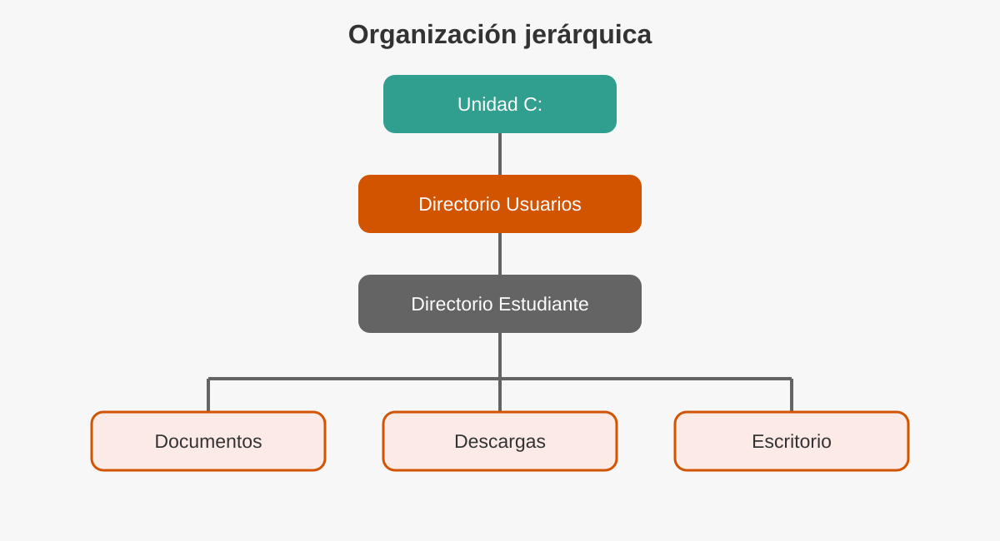
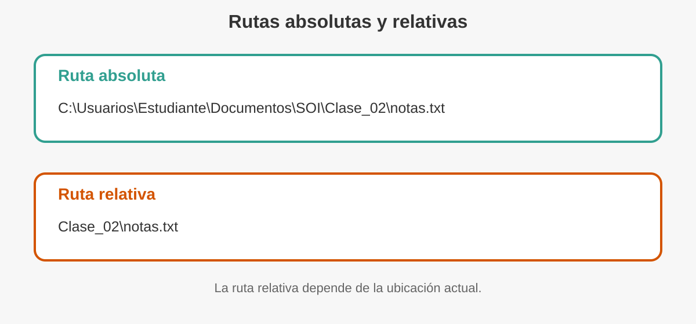
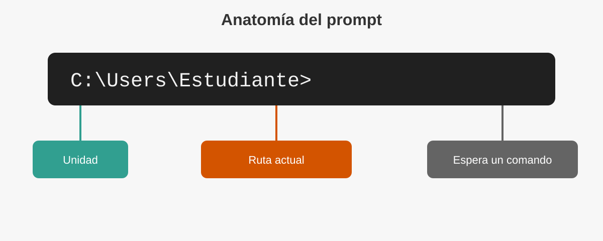
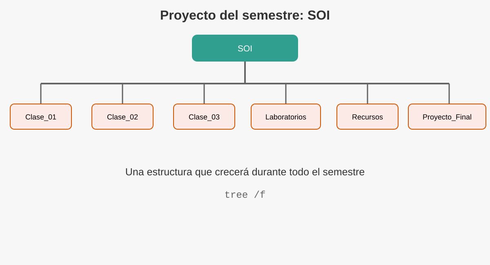

# Presentación de la clase

En la clase anterior estudiamos qué es un sistema operativo y por qué constituye la base de todo sistema informático. En esta sesión nos concentraremos en una de sus funciones más visibles: **organizar y administrar la información almacenada**.

Cada documento, fotografía, programa o proyecto necesita un lugar dentro del sistema. Cuando esa información está bien organizada, puede localizarse, copiarse, trasladarse o eliminarse con rapidez. Cuando no lo está, incluso un archivo que sigue existiendo puede parecer perdido.

La administración de archivos puede realizarse mediante ventanas e iconos, pero también a través de instrucciones escritas. Por ello, en esta clase utilizaremos el **Símbolo del sistema de Windows (CMD)** para comprender cómo piensa el sistema operativo cuando trabaja con unidades, directorios, rutas y archivos.

::: {.callout-note title="Idea central"}
Los comandos no son palabras aisladas para memorizar. Son instrucciones que expresan una necesidad concreta: ver, entrar, crear, copiar, mover, renombrar o eliminar.
:::

## Objetivos de aprendizaje

Al finalizar esta clase, el estudiante será capaz de:

- Explicar cómo organiza el sistema operativo la información.
- Diferenciar unidades, directorios, subdirectorios y archivos.
- Interpretar rutas absolutas y relativas.
- Reconocer la función del intérprete de comandos de Windows.
- Utilizar comandos básicos para navegar y organizar información.
- Aplicar buenas prácticas para evitar errores durante la administración de archivos.

## Ruta de trabajo de la sesión

| Momento | Actividad | Tiempo aproximado |
|---|---|---:|
| Inicio | Situación problemática y conceptos base | 15 min |
| Desarrollo | Directorios, archivos, rutas y CMD | 20 min |
| Laboratorio | Construcción del proyecto `SOI` | 35 min |
| Aplicación | Reto guiado y análisis de errores | 15 min |
| Cierre | Síntesis y autoevaluación | 5 min |

# ¿Dónde está realmente un archivo?

Imagine que debe entregar un proyecto al finalizar la clase. Está seguro de haberlo guardado, pero no recuerda si quedó en **Documentos**, **Descargas**, **Escritorio** o una memoria USB.

El archivo no necesariamente se perdió. El problema puede ser que desconoce su ubicación.

Los sistemas operativos resuelven esta situación mediante una organización jerárquica. En lugar de almacenar toda la información en un único espacio, la distribuyen en unidades, directorios y subdirectorios.

{#fig-jerarquia width=88%}

En esta estructura:

- La **unidad** representa un dispositivo o volumen de almacenamiento.
- El **directorio** agrupa información relacionada.
- El **subdirectorio** es un directorio ubicado dentro de otro.
- El **archivo** contiene los datos que utiliza el usuario o una aplicación.

::: {.callout-tip title="Consejo del Ingeniero"}
Un archivo bien nombrado y guardado en una estructura lógica puede ahorrar más tiempo que cualquier comando avanzado.
:::

# El sistema de archivos

Un **sistema de archivos** es el conjunto de reglas y estructuras que utiliza el sistema operativo para registrar, organizar, localizar y proteger la información dentro de un dispositivo de almacenamiento.

El usuario observa carpetas y nombres. Internamente, el sistema operativo también mantiene datos como:

- ubicación lógica;
- tamaño;
- fecha de creación y modificación;
- permisos;
- atributos;
- relación entre directorios y archivos.

La organización lógica evita que el usuario deba conocer el lugar físico exacto donde se encuentran los datos dentro del dispositivo.

## Unidades de almacenamiento

En Windows, las unidades suelen identificarse mediante una letra seguida de dos puntos:

```text
C:
D:
E:
```

La unidad `C:` suele contener el sistema operativo y los perfiles de usuario. Otras letras pueden representar particiones, memorias USB, discos externos, unidades ópticas o recursos conectados.

::: {.callout-warning title="No confundir"}
La letra no indica por sí sola el tipo de dispositivo. Una memoria USB puede aparecer como `D:`, `E:` o cualquier otra letra disponible.
:::

## Directorios y carpetas

En Windows se utiliza con frecuencia la palabra **carpeta**. En el lenguaje técnico y en la línea de comandos se emplea el término **directorio**.

Ambos describen una estructura que permite agrupar archivos y otros directorios.

```text
C:\
└── Usuarios
    └── Estudiante
        ├── Documentos
        ├── Descargas
        └── Escritorio
```

## Archivos y extensiones

Un archivo es una unidad de información identificada mediante un nombre.

```text
informe.docx
presupuesto.xlsx
programa.cpp
manual.pdf
imagen.png
```

La parte ubicada después del último punto se denomina **extensión**. Esta ayuda al sistema operativo y a las aplicaciones a reconocer el formato del archivo.

::: {.callout-important title="Idea clave"}
Cambiar `fotografia.jpg` por `fotografia.pdf` no transforma la imagen en un PDF. Solo modifica el nombre.
:::

# Rutas: la dirección de la información

Una **ruta** indica la ubicación de un archivo o directorio dentro de la jerarquía del sistema.

{#fig-rutas width=92%}

## Ruta absoluta

Una ruta absoluta comienza desde la unidad y describe el recorrido completo.

```text
C:\Usuarios\Estudiante\Documentos\SOI\Clase_02\notas.txt
```

Esta ruta puede interpretarse de izquierda a derecha:

1. Unidad `C:`.
2. Directorio `Usuarios`.
3. Perfil `Estudiante`.
4. Directorio `Documentos`.
5. Proyecto `SOI`.
6. Directorio `Clase_02`.
7. Archivo `notas.txt`.

## Ruta relativa

Una ruta relativa se interpreta desde la ubicación actual.

Si la ubicación actual es:

```text
C:\Usuarios\Estudiante\Documentos\SOI
```

la ruta relativa hacia el archivo anterior sería:

```text
Clase_02\notas.txt
```

El símbolo `..` representa el directorio superior.

```text
cd ..
```

significa:

> Subir un nivel dentro de la estructura.

## Separadores y espacios

Windows utiliza la barra invertida `\` para separar los componentes de una ruta.

Cuando una ruta contiene espacios, es recomendable escribirla entre comillas:

```text
cd "C:\Usuarios\Estudiante\Mis documentos"
```

# De la interfaz gráfica a la línea de comandos

La interfaz gráfica permite administrar información mediante ventanas, iconos, menús y el puntero. La interfaz de línea de comandos permite hacerlo escribiendo instrucciones.

| Interfaz gráfica | Línea de comandos |
|---|---|
| Utiliza ventanas e iconos | Utiliza instrucciones escritas |
| Es visual e intuitiva | Es precisa y reproducible |
| Facilita tareas ocasionales | Facilita automatización y diagnóstico |
| Requiere navegación manual | Puede ejecutar secuencias rápidamente |

Ninguna reemplaza completamente a la otra. Un profesional utiliza la herramienta más adecuada para cada situación.

# ¿Qué es un comando?

Un **comando** es una instrucción que el usuario entrega a un intérprete para solicitar una acción.

Ejemplos:

```bat
dir
```

Solicita mostrar el contenido del directorio actual.

```bat
mkdir Clase_02
```

Solicita crear un directorio llamado `Clase_02`.

```bat
copy notas.txt respaldo.txt
```

Solicita crear una copia del archivo.

Los comandos pueden aceptar:

- **argumentos**, que indican sobre qué elemento trabajar;
- **opciones**, que modifican la forma en que se ejecuta la instrucción.

Ejemplo:

```bat
dir /w
```

- `dir` es el comando.
- `/w` es una opción que muestra una vista resumida.

# CMD en Windows

El **Símbolo del sistema**, también conocido como **CMD**, es un intérprete de comandos incluido en Windows.

No debe confundirse con MS-DOS. Aunque conserva numerosos comandos históricos, CMD funciona dentro de Windows y utiliza los servicios del sistema operativo actual.

## Cómo abrirlo

Puede abrirse de distintas maneras:

1. Presionar la tecla Windows.
2. Escribir `cmd`.
3. Seleccionar **Símbolo del sistema**.

También puede utilizarse la ventana **Ejecutar**:

```text
Windows + R
```

Luego escribir:

```text
cmd
```

y presionar Enter.

::: {.callout-warning title="Permisos administrativos"}
Para esta práctica no es necesario abrir CMD como administrador. Trabajar con privilegios elevados aumenta el impacto de un error.
:::

# Anatomía del prompt

Al abrir CMD aparece una línea similar a:

```text
C:\Users\Estudiante>
```

{#fig-prompt width=88%}

El prompt muestra la ubicación actual y termina con el símbolo `>` para indicar que el intérprete espera una instrucción.

```text
C:                         unidad
\Users\Estudiante          ruta actual
>                          espera un comando
```

::: {.callout-note title="Observe"}
Cada vez que cambia de directorio, el prompt también cambia. Por eso funciona como una brújula dentro del sistema de archivos.
:::

# Laboratorio narrativo: construyendo el proyecto SOI

## Situación

Durante el semestre se generarán apuntes, prácticas, recursos y entregables. Para evitar que todo quede mezclado, construiremos una estructura permanente llamada `SOI`.

El laboratorio se realizará dentro de **Documentos**. No trabaje en directorios del sistema como `C:\Windows` o `C:\Program Files`.

## Paso 1. Saber dónde estamos

Escriba:

```bat
cd
```

CMD mostrará la ruta actual.

También puede observarla directamente en el prompt.

## Paso 2. Ver el contenido

Ejecute:

```bat
dir
```

El comando `dir` muestra directorios y archivos de la ubicación actual.

En la salida encontrará datos como:

- fecha y hora;
- indicador `<DIR>` para directorios;
- tamaño de archivos;
- nombre de cada elemento.

### Variantes útiles

```bat
dir /w
```

Muestra una vista resumida.

```bat
dir /p
```

Pausa la salida cuando ocupa más de una pantalla.

```bat
dir *.txt
```

Muestra únicamente archivos con extensión `.txt`.

::: {.callout-tip title="Lectura antes de acción"}
Antes de crear, mover o borrar algo, use `dir`. Confirmar la ubicación reduce errores.
:::

## Paso 3. Ir a Documentos

Según el idioma y la configuración de Windows, el nombre visible puede variar. Una forma práctica es utilizar la variable del perfil:

```bat
cd /d "%USERPROFILE%\Documents"
```

Si la carpeta se muestra en español pero la ruta interna utiliza `Documents`, el comando seguirá funcionando.

La opción `/d` permite cambiar de unidad y directorio en una sola instrucción.

## Paso 4. Crear el directorio principal

```bat
mkdir SOI
```

También puede utilizarse la forma abreviada:

```bat
md SOI
```

Ambos comandos crean el directorio.

Compruebe el resultado:

```bat
dir
```

## Paso 5. Entrar al proyecto

```bat
cd SOI
```

El prompt debería terminar de forma similar a:

```text
...\Documents\SOI>
```

## Paso 6. Crear la estructura del semestre

Ejecute:

```bat
mkdir Clase_01 Clase_02 Clase_03 Laboratorios Recursos Proyecto_Final
```

Luego verifique:

```bat
dir
```

La estructura esperada es:

```text
SOI
├── Clase_01
├── Clase_02
├── Clase_03
├── Laboratorios
├── Recursos
└── Proyecto_Final
```

{#fig-proyecto width=84%}

## Paso 7. Visualizar el árbol

Ejecute:

```bat
tree
```

Para incluir también archivos:

```bat
tree /f
```

`tree` permite comprobar visualmente la jerarquía construida.

# Navegación con `cd`

El comando `cd` significa **change directory**, es decir, cambiar de directorio.

## Entrar a un directorio

```bat
cd Clase_02
```

## Subir un nivel

```bat
cd ..
```

## Ir a la raíz de la unidad

```bat
cd \
```

## Cambiar directamente mediante una ruta

```bat
cd /d "%USERPROFILE%\Documents\SOI\Clase_02"
```

## Volver al directorio anterior

CMD no ofrece exactamente el mismo comportamiento que algunos intérpretes modernos, por lo que conviene leer el prompt y utilizar rutas relativas o absolutas de manera consciente.

::: {.callout-warning title="Error común"}
`cd...` no es la forma correcta de subir un nivel. Debe existir un espacio:

```bat
cd ..
```
:::

# Crear archivos de práctica

Para continuar necesitamos archivos sencillos.

Ubíquese dentro de `Clase_02`:

```bat
cd /d "%USERPROFILE%\Documents\SOI\Clase_02"
```

Cree un archivo de texto:

```bat
echo Apuntes de la Clase 2 > apuntes.txt
```

Agregue una segunda línea:

```bat
echo Practica de comandos de Windows >> apuntes.txt
```

Los operadores utilizados son:

- `>` crea o reemplaza el contenido.
- `>>` agrega contenido al final.

Compruebe el archivo:

```bat
dir
```

Muestre su contenido:

```bat
type apuntes.txt
```

::: {.callout-important title="Precaución"}
El operador `>` reemplaza el contenido existente. Antes de usarlo sobre un archivo importante, compruebe el nombre y la ruta.
:::

# Copiar archivos con `copy`

El comando `copy` crea una copia de uno o varios archivos.

## Copiar en el mismo directorio

```bat
copy apuntes.txt respaldo_apuntes.txt
```

## Copiar hacia otro directorio

```bat
copy apuntes.txt ..\Recursos\
```

La ruta `..\Recursos\` significa:

1. subir desde `Clase_02` hacia `SOI`;
2. entrar en `Recursos`.

Compruebe el resultado:

```bat
dir ..\Recursos
```

## Evitar sobrescrituras accidentales

Puede utilizar:

```bat
copy /-y apuntes.txt respaldo_apuntes.txt
```

La opción `/-y` solicita confirmación antes de reemplazar un archivo existente.

# Renombrar con `ren`

El comando `ren` cambia el nombre de un archivo o directorio.

```bat
ren respaldo_apuntes.txt apuntes_copia.txt
```

Compruebe:

```bat
dir
```

La instrucción cambia el nombre, pero no traslada el archivo a otra ubicación.

::: {.callout-note title="Diferencia importante"}
- `ren` cambia el nombre.
- `move` cambia la ubicación y también puede cambiar el nombre.
:::

# Mover con `move`

Para trasladar un archivo:

```bat
move apuntes_copia.txt ..\Laboratorios\
```

Compruebe el directorio de destino:

```bat
dir ..\Laboratorios
```

También puede mover y renombrar en una sola instrucción:

```bat
move apuntes.txt ..\Laboratorios\bitacora_clase_02.txt
```

# Eliminar archivos con `del`

El comando `del` elimina archivos.

Primero cree un archivo temporal:

```bat
echo Archivo temporal > temporal.txt
```

Compruebe:

```bat
dir
```

Luego elimínelo solicitando confirmación:

```bat
del /p temporal.txt
```

::: {.callout-warning title="Advertencia"}
Los archivos eliminados desde CMD normalmente no pasan por la Papelera de reciclaje. Verifique siempre la ruta, el nombre y los comodines antes de confirmar.
:::

## Riesgo de los comodines

```bat
del *.txt
```

elimina todos los archivos `.txt` del directorio actual.

Este tipo de instrucción no debe ejecutarse sin revisar previamente:

```bat
dir *.txt
```

La secuencia profesional es:

```text
1. Mostrar
2. Verificar
3. Ejecutar
```

# Eliminar directorios con `rmdir`

`rmdir` o `rd` elimina directorios.

## Directorio vacío

```bat
mkdir Prueba_Vacia
rmdir Prueba_Vacia
```

## Directorio con contenido

```bat
rmdir /s Carpeta
```

La opción `/s` incluye todo su contenido.

Para solicitar confirmación:

```bat
rmdir /s Carpeta
```

Para omitirla existe `/q`, pero no debe utilizarse durante el aprendizaje:

```bat
rmdir /s /q Carpeta
```

::: {.callout-danger title="Comando de alto impacto"}
`rmdir /s /q` puede eliminar una estructura completa sin preguntar. No lo utilice fuera de carpetas de práctica.
:::

# Limpiar la pantalla con `cls`

```bat
cls
```

Este comando limpia la pantalla, pero no elimina archivos ni modifica la ubicación actual.

Después de ejecutarlo, el prompt continúa en el mismo directorio.

# Resumen de comandos

| Necesidad | Comando principal | Ejemplo |
|---|---|---|
| Mostrar ubicación | `cd` | `cd` |
| Listar contenido | `dir` | `dir /w` |
| Cambiar directorio | `cd` | `cd Clase_02` |
| Crear directorio | `mkdir` o `md` | `mkdir Recursos` |
| Mostrar árbol | `tree` | `tree /f` |
| Mostrar texto | `type` | `type apuntes.txt` |
| Copiar archivo | `copy` | `copy a.txt b.txt` |
| Renombrar | `ren` | `ren a.txt b.txt` |
| Mover | `move` | `move a.txt ..\Recursos\` |
| Eliminar archivo | `del` | `del /p a.txt` |
| Eliminar directorio | `rmdir` o `rd` | `rmdir Carpeta` |
| Limpiar pantalla | `cls` | `cls` |

# Reto de aplicación

## Escenario

El directorio `SOI` debe quedar organizado de la siguiente manera:

```text
SOI
├── Clase_01
├── Clase_02
├── Clase_03
├── Laboratorios
│   └── bitacora_clase_02.txt
├── Recursos
│   └── apuntes.txt
└── Proyecto_Final
```

## Reglas

Realice el reto únicamente con comandos.

1. Compruebe la ubicación actual.
2. Navegue hasta `SOI`.
3. Use `tree /f` para revisar la estructura.
4. Asegúrese de que `apuntes.txt` esté en `Recursos`.
5. Asegúrese de que `bitacora_clase_02.txt` esté en `Laboratorios`.
6. Elimine únicamente archivos temporales creados durante la práctica.
7. Muestre el árbol final.

## Evidencia sugerida

El estudiante puede entregar:

- captura del comando `tree /f`;
- lista de comandos utilizados;
- explicación breve de un error cometido y cómo lo corrigió.

# Diagnóstico de errores frecuentes

## “El sistema no puede encontrar la ruta especificada”

Posibles causas:

- el directorio no existe;
- el nombre fue escrito incorrectamente;
- la ruta contiene espacios y no se utilizaron comillas;
- la ubicación actual no es la esperada.

Acciones:

```bat
cd
dir
```

Luego revise la ruta paso a paso.

## “El sistema no puede encontrar el archivo especificado”

Compruebe:

```bat
dir
dir *.txt
```

Revise el nombre y la extensión real.

## “Acceso denegado”

Puede ocurrir cuando:

- el archivo está protegido;
- otro programa lo utiliza;
- el usuario no posee permisos;
- se trabaja en un directorio del sistema.

No resuelva automáticamente el problema ejecutando todo como administrador. Primero determine la causa.

## El comando se ejecutó en el lugar equivocado

Compruebe siempre el prompt. Una instrucción correcta ejecutada en un directorio incorrecto puede producir un resultado no deseado.

::: {.callout-tip title="Método de recuperación"}
Cuando se sienta perdido:

```bat
cd
dir
```

Primero determine dónde está. Luego decida a dónde necesita ir.
:::

# Buenas prácticas

1. Utilice nombres descriptivos.
2. Evite crear todos los archivos en el Escritorio.
3. Compruebe la ubicación antes de modificar información.
4. Use `dir` antes de aplicar comandos destructivos.
5. Practique con archivos temporales.
6. No trabaje como administrador sin necesidad.
7. Mantenga respaldos de los archivos importantes.
8. Lea los mensajes del sistema antes de repetir una instrucción.

# Autoevaluación

## Selección breve

1. ¿Qué representa `C:`?
   - a) Un archivo
   - b) Una unidad
   - c) Un comando
   - d) Una extensión

2. ¿Qué comando muestra el contenido del directorio actual?
   - a) `show`
   - b) `list`
   - c) `dir`
   - d) `type`

3. ¿Qué significa `..` dentro de una ruta?
   - a) Directorio actual
   - b) Directorio superior
   - c) Unidad principal
   - d) Archivo oculto

4. ¿Cuál comando crea un directorio?
   - a) `mkdir`
   - b) `copy`
   - c) `type`
   - d) `cls`

5. ¿Cuál acción requiere mayor precaución?
   - a) `dir`
   - b) `cd`
   - c) `del`
   - d) `cls`

## Preguntas de reflexión

1. ¿Por qué una ruta absoluta funciona aunque el usuario se encuentre en otro directorio?
2. ¿Qué ventaja ofrece una ruta relativa?
3. ¿Por qué conviene ejecutar `dir` antes de `del`?
4. ¿Qué diferencia existe entre copiar y mover?
5. ¿Por qué CMD no debe presentarse simplemente como MS-DOS?

# Resumen de la clase

En esta clase aprendimos que:

- El sistema operativo organiza la información mediante un sistema de archivos.
- Las unidades contienen directorios, subdirectorios y archivos.
- Una ruta expresa la ubicación de un elemento.
- Las rutas pueden ser absolutas o relativas.
- CMD permite comunicarse con Windows mediante comandos.
- `dir`, `cd`, `mkdir` y `tree` permiten explorar y construir estructuras.
- `copy`, `ren` y `move` permiten reorganizar archivos.
- `del` y `rmdir` requieren especial cuidado.
- Una práctica profesional comienza por verificar la ubicación y el contenido.

::: {.callout-tip title="Consejo final del Ingeniero"}
La línea de comandos se domina practicando. La velocidad llegará después; primero deben desarrollarse precisión, lectura y criterio.
:::

# Tarea sugerida

Construya desde CMD una estructura para organizar sus cursos del semestre:

```text
Universidad
├── Sistemas_Operativos_I
├── Algoritmos
├── Programacion
└── Proyecto_Semestral
```

Dentro de cada curso cree:

```text
Apuntes
Laboratorios
Tareas
Recursos
```

Genere un archivo `descripcion.txt` en cada curso y escriba una línea que describa su propósito. Entregue el resultado de:

```bat
tree /f
```

# Cierre

En la próxima clase estudiaremos herramientas de administración de Windows que permiten inspeccionar configuración, servicios, inicio del sistema y otros componentes. El objetivo no será abrir utilidades por curiosidad, sino comprender qué problema resuelve cada una y qué riesgos implica modificarla.
