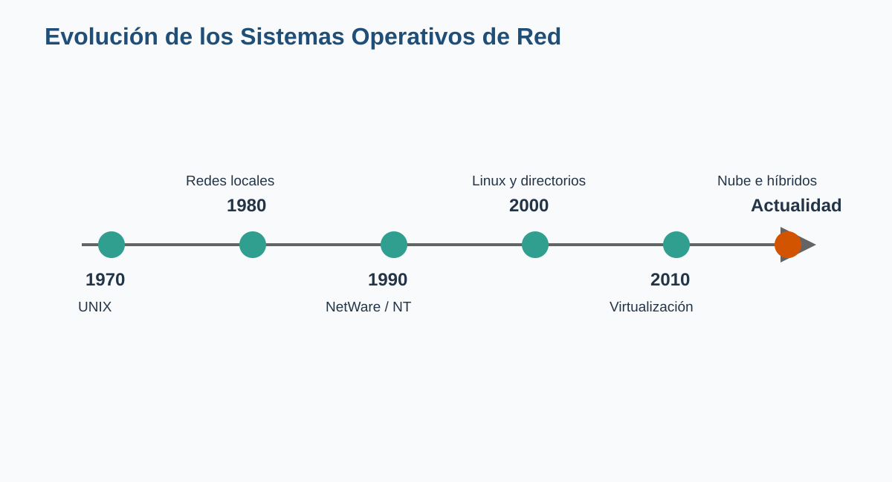
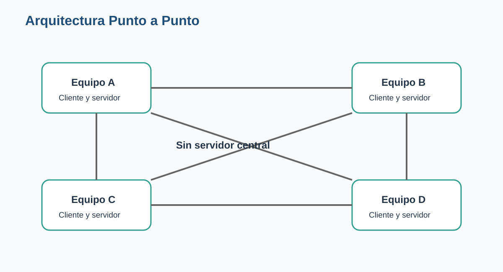
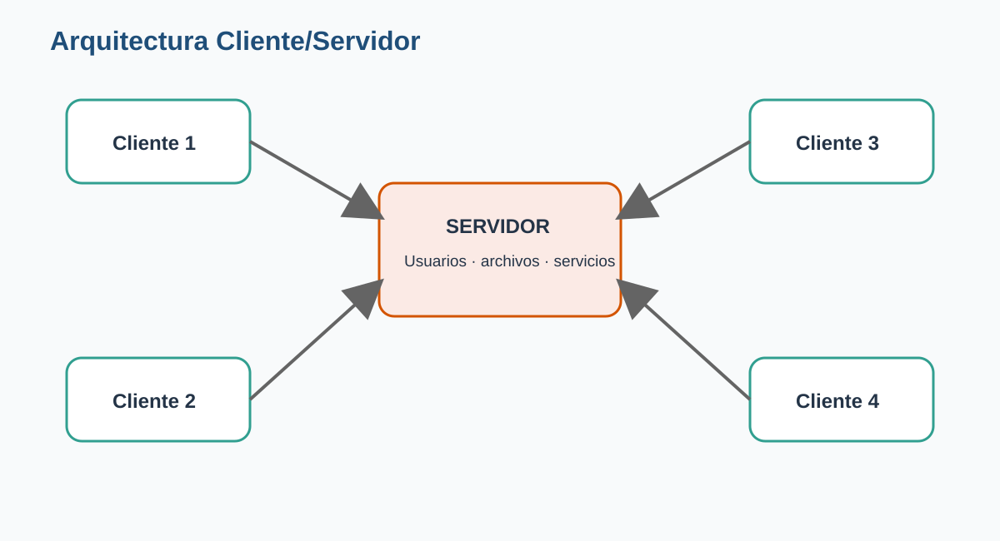
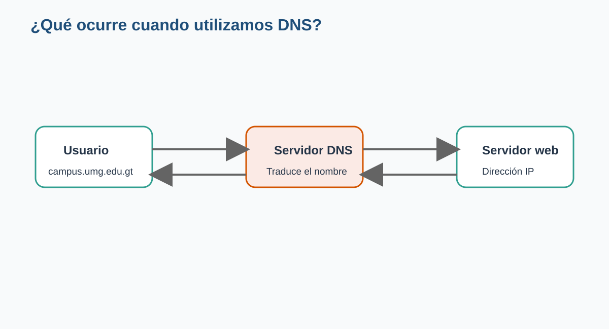
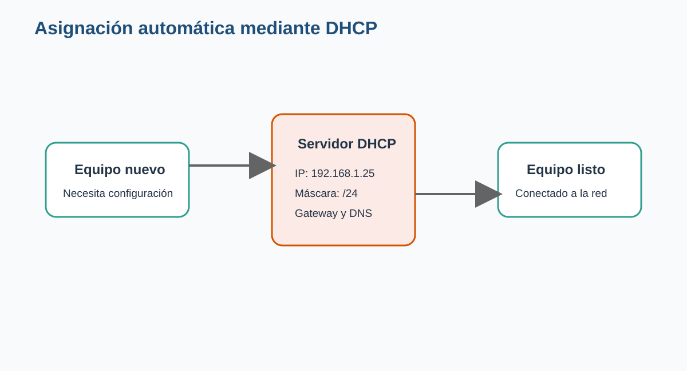
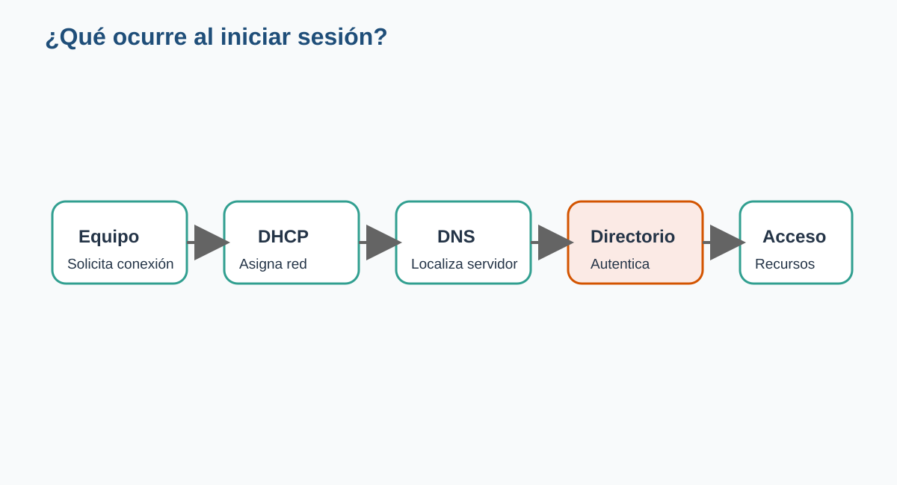
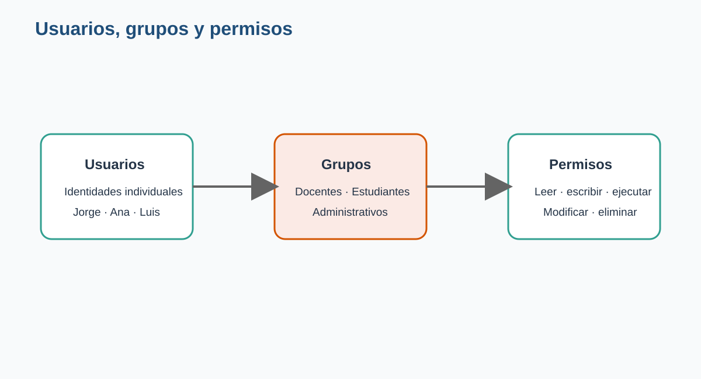
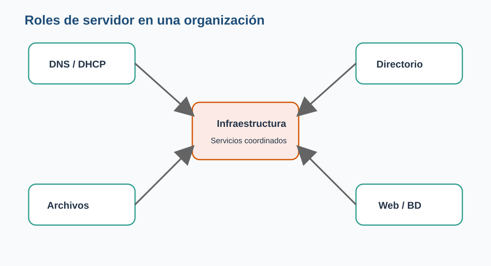
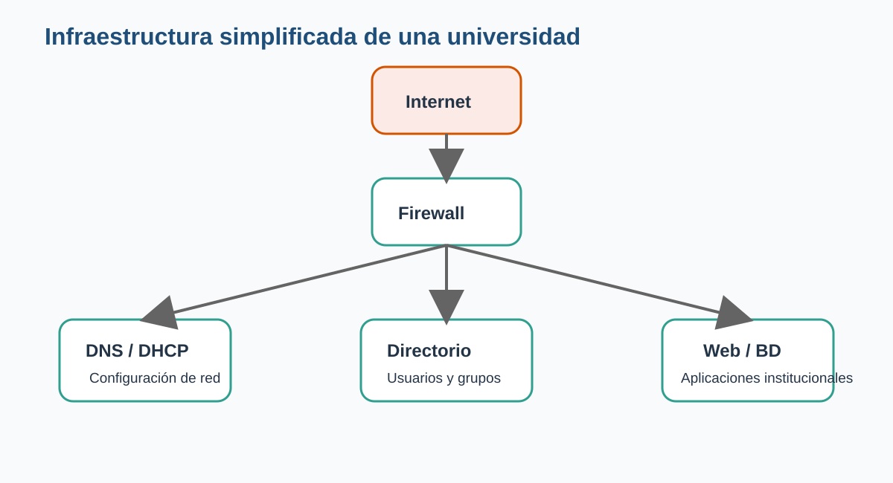
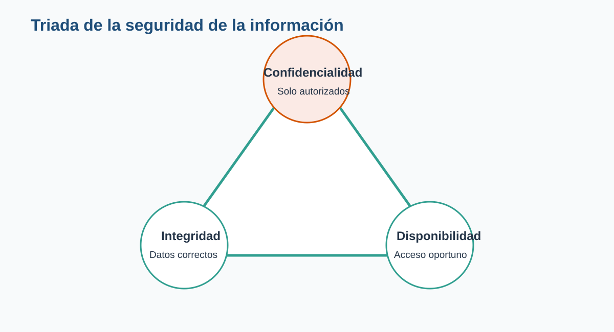

# Presentación de la clase

Cuando una computadora trabaja de forma aislada, su sistema operativo administra los recursos del equipo: procesador, memoria, archivos, dispositivos y aplicaciones. Sin embargo, en cuanto varias computadoras deben compartir información, impresoras, usuarios o aplicaciones, aparece una necesidad diferente: **administrar la red como un sistema organizado**.

Un laboratorio universitario, una clínica, una empresa o una institución pública no puede depender de que cada usuario configure manualmente su equipo, guarde los archivos donde quiera y decida por su cuenta qué información comparte. Conforme aumenta el número de computadoras, también crecen los riesgos, los errores y el esfuerzo de administración.

Los **Sistemas Operativos de Red** surgieron para resolver este problema. Permiten centralizar usuarios, permisos, servicios y recursos, de manera que una organización pueda trabajar con mayor seguridad, orden y continuidad.

::: {.callout-note appearance="simple"}
## Pregunta detonadora

Cuando un estudiante enciende una computadora del laboratorio e inicia sesión con su cuenta institucional, ¿quién valida su contraseña, le asigna una dirección IP, localiza los servidores y determina qué carpetas puede consultar?
:::

La respuesta no depende de un único programa. Detrás de esa acción participan varios servicios coordinados por uno o más servidores. Esta clase explica cómo funciona esa infraestructura y por qué constituye una pieza esencial de cualquier organización moderna.

# Objetivos de aprendizaje

Al finalizar esta clase, el estudiante será capaz de:

1. Explicar qué es un Sistema Operativo de Red y por qué es necesario.
2. Describir la evolución de los Sistemas Operativos de Red.
3. Diferenciar las arquitecturas Punto a Punto y Cliente/Servidor.
4. Identificar los principales servicios que operan dentro de una red.
5. Explicar la relación entre usuarios, grupos y permisos.
6. Reconocer los roles más comunes de un servidor.
7. Comparar, de manera general, Windows Server, Linux y UNIX.
8. Aplicar principios básicos de seguridad y continuidad operativa.
9. Diseñar una propuesta elemental de infraestructura para un caso real.

# Ruta de aprendizaje

La clase seguirá la siguiente secuencia:

1. Comprenderemos por qué surgieron los Sistemas Operativos de Red.
2. Revisaremos su evolución histórica.
3. Compararemos las arquitecturas Punto a Punto y Cliente/Servidor.
4. Estudiaremos servicios como DNS, DHCP, autenticación y archivos.
5. Analizaremos usuarios, grupos y permisos.
6. Identificaremos plataformas y roles de servidor.
7. Relacionaremos la infraestructura con la seguridad.
8. Resolveremos un laboratorio basado en una organización real.

# ¿Por qué existen los Sistemas Operativos de Red?

Imaginemos una oficina pequeña con tres computadoras. Cada usuario guarda sus documentos localmente y comparte algunos archivos mediante una carpeta. Esta solución puede funcionar al inicio.

Ahora imaginemos que la oficina crece hasta tener cincuenta empleados, varias sedes, impresoras compartidas, una base de datos y aplicaciones institucionales. Administrar cada computadora por separado se vuelve lento, inseguro y difícil de controlar.

Sin una administración centralizada pueden aparecer problemas como los siguientes:

- Usuarios con contraseñas débiles o compartidas.
- Archivos duplicados en distintas computadoras.
- Información importante sin respaldo.
- Permisos asignados de manera inconsistente.
- Direcciones IP repetidas.
- Equipos sin actualizaciones.
- Dificultad para identificar quién realizó una acción.
- Interrupciones prolongadas cuando falla un equipo.

Un Sistema Operativo de Red proporciona los mecanismos necesarios para organizar estos recursos y servicios.

## ¿Qué es un Sistema Operativo de Red?

Un **Sistema Operativo de Red**, también llamado *Network Operating System* o NOS, es un sistema diseñado para administrar los recursos y servicios compartidos dentro de una red de computadoras.

Entre sus responsabilidades se encuentran:

- Administrar usuarios y equipos.
- Controlar el acceso a los recursos.
- Compartir archivos e impresoras.
- Proporcionar servicios de comunicación.
- Registrar eventos y actividades.
- Aplicar políticas de seguridad.
- Facilitar la administración remota.
- Mantener disponibles las aplicaciones institucionales.

::: {.callout-tip appearance="simple"}
## Idea central

Un Sistema Operativo de Red no se limita a conectar computadoras. Su función principal es **organizar, proteger y administrar los recursos compartidos de una organización**.
:::

## Sistema operativo de escritorio y Sistema Operativo de Red

Un sistema operativo de escritorio está orientado principalmente a la experiencia de una persona frente a un equipo. Un Sistema Operativo de Red está orientado a ofrecer servicios a muchos usuarios y dispositivos.

| Aspecto | Sistema de escritorio | Sistema Operativo de Red |
|---|---|---|
| Enfoque principal | Uso individual | Servicios compartidos |
| Número de usuarios | Uno o pocos | Decenas, cientos o miles |
| Administración | Local | Centralizada |
| Disponibilidad esperada | Variable | Alta |
| Seguridad | Centrada en el equipo | Centrada en usuarios, servicios y datos |
| Acceso remoto | Complementario | Fundamental |
| Escalabilidad | Limitada | Diseñada para crecer |

En la práctica, ambos pueden compartir tecnologías. Un sistema moderno de escritorio puede compartir archivos y un servidor puede incluir interfaz gráfica. La diferencia principal está en el **propósito**, la **configuración** y el nivel de administración requerido.

# Evolución de los Sistemas Operativos de Red

Los Sistemas Operativos de Red no aparecieron de forma repentina. Son el resultado de décadas de evolución en la forma de compartir recursos y procesar información.

{#fig-evolucion width=95%}

## Los primeros sistemas multiusuario

Durante las décadas de 1960 y 1970, las computadoras eran equipos costosos y de gran tamaño. Para aprovecharlas, varios usuarios se conectaban mediante terminales. En este contexto, UNIX introdujo conceptos fundamentales:

- Multiusuario.
- Multitarea.
- Sistemas de archivos jerárquicos.
- Permisos.
- Administración remota.
- Herramientas pequeñas que podían combinarse.

Estas ideas influyeron en numerosos sistemas posteriores.

## TCP/IP y la expansión de las redes

En la década de 1980, las implementaciones derivadas de BSD incorporaron herramientas de comunicación basadas en TCP/IP y sockets. Esto facilitó que diferentes equipos pudieran intercambiar información utilizando estándares comunes.

TCP/IP terminó convirtiéndose en la base de Internet y de la mayoría de redes actuales.

## Redes locales y Novell NetWare

Con la expansión de las redes locales, empresas y universidades comenzaron a compartir archivos e impresoras. Novell NetWare se convirtió en una plataforma muy importante para estas tareas.

Su éxito se debió a que ofrecía:

- Buen rendimiento como servidor de archivos.
- Administración de usuarios.
- Servicios de impresión.
- Compatibilidad con diferentes clientes.
- Capacidad para operar en redes empresariales.

Aunque perdió presencia con el crecimiento de Windows Server y Linux, NetWare representa una etapa clave en la historia de las redes.

## Windows NT y Windows Server

Microsoft desarrolló Windows NT como una plataforma orientada a entornos empresariales. Posteriormente evolucionó hacia la familia Windows Server.

Estas plataformas incorporaron servicios como:

- Administración de dominios.
- Active Directory.
- Políticas de grupo.
- Servicios de archivos e impresión.
- DNS y DHCP.
- Virtualización.
- Administración remota.

Su integración con equipos Windows facilitó su adopción en muchas organizaciones.

## El crecimiento de Linux

Linux heredó la filosofía de UNIX y se desarrolló mediante una comunidad internacional. Su estabilidad, flexibilidad y capacidad de adaptación lo convirtieron en una opción ampliamente utilizada para servidores.

Hoy es común encontrar Linux en:

- Servidores web.
- Bases de datos.
- Centros de datos.
- Plataformas de nube.
- Dispositivos de red.
- Supercomputadoras.
- Sistemas embebidos.

## Virtualización, contenedores y nube

Durante muchos años se instalaba un servidor físico para cada servicio. Esto provocaba altos costos de energía, espacio y mantenimiento.

La virtualización permitió ejecutar varios servidores virtuales dentro de un mismo equipo físico. Posteriormente, los contenedores facilitaron empaquetar aplicaciones y dependencias de forma más ligera.

La computación en la nube añadió otra posibilidad: utilizar infraestructura administrada por proveedores externos y pagar según la capacidad consumida.

::: {.callout-note appearance="simple"}
## Ingeniería en la vida real

Una universidad que antes necesitaba comprar un servidor físico para cada aplicación puede ejecutar varios servidores virtuales en un clúster local, mantener respaldos fuera del campus y utilizar servicios en la nube para atender períodos de alta demanda.
:::

# Arquitecturas de red

Una arquitectura de red describe cómo se organizan los equipos y cómo solicitan o proporcionan servicios. Dos modelos fundamentales son:

- Punto a Punto.
- Cliente/Servidor.

# Arquitectura Punto a Punto

En una red **Punto a Punto**, también llamada *Peer to Peer* o P2P, los equipos poseen un nivel semejante. Cada computadora puede solicitar recursos y también compartir los propios.

{#fig-p2p width=90%}

## Ejemplo

Un pequeño despacho posee cuatro computadoras. Una comparte la impresora, otra contiene una carpeta de proyectos y las demás permiten consultar ciertos documentos.

No existe un servidor central. Cada usuario decide qué comparte y con quién.

## Ventajas

- Bajo costo inicial.
- Configuración relativamente sencilla.
- No requiere un servidor dedicado.
- Puede ser suficiente para pocos usuarios.
- Permite compartir recursos rápidamente.

## Limitaciones

- La administración depende de cada equipo.
- Es difícil mantener permisos consistentes.
- Los respaldos quedan dispersos.
- La seguridad es limitada.
- Un recurso deja de estar disponible si se apaga el equipo que lo comparte.
- El crecimiento aumenta rápidamente la complejidad.

## ¿Cuándo puede utilizarse?

Puede ser apropiada cuando:

- Hay pocos equipos.
- La información no es crítica.
- El presupuesto es muy reducido.
- No se requiere administración centralizada.
- La red es temporal o doméstica.

::: {.callout-warning appearance="simple"}
## Cuidado

Que una red Punto a Punto sea fácil de instalar no significa que sea adecuada para cualquier organización. Cuando existen datos sensibles, muchos usuarios o necesidad de auditoría, este modelo suele quedarse corto.
:::

# Arquitectura Cliente/Servidor

En una arquitectura **Cliente/Servidor**, uno o varios servidores proporcionan servicios especializados y los equipos cliente los solicitan.

{#fig-cliente-servidor width=90%}

Un cliente puede ser:

- Una computadora de escritorio.
- Una computadora portátil.
- Un teléfono.
- Una tableta.
- Una aplicación.
- Otro servidor.

El servidor procesa las solicitudes y responde de acuerdo con las reglas, permisos y recursos disponibles.

## Ejemplo universitario

En un laboratorio, los estudiantes inician sesión desde diferentes computadoras. Un servidor valida las credenciales, otro aloja el Campus Virtual y otro contiene las bases de datos.

El estudiante observa una experiencia sencilla, pero la infraestructura se encuentra distribuida y administrada.

## Ventajas

- Administración centralizada.
- Mayor control de usuarios.
- Permisos consistentes.
- Respaldos más sencillos.
- Mejor capacidad de crecimiento.
- Posibilidad de alta disponibilidad.
- Auditoría y monitoreo centralizados.

## Limitaciones

- Mayor inversión inicial.
- Requiere personal capacitado.
- Los servidores son componentes críticos.
- Una mala configuración puede afectar a muchos usuarios.
- Se necesita planificar respaldo, redundancia y recuperación.

## Comparación general

| Característica | Punto a Punto | Cliente/Servidor |
|---|---|---|
| Servidor dedicado | No es necesario | Generalmente sí |
| Administración | Distribuida | Centralizada |
| Seguridad | Básica | Mayor control |
| Escalabilidad | Baja | Alta |
| Respaldos | Dispersos | Centralizados |
| Costo inicial | Bajo | Medio o alto |
| Disponibilidad | Depende de cada equipo | Puede diseñarse con redundancia |
| Uso típico | Hogares y oficinas pequeñas | Organizaciones medianas y grandes |

::: {.callout-tip appearance="simple"}
## Criterio de ingeniería

La arquitectura adecuada no es la más costosa ni la más moderna. Es la que responde a los requerimientos de seguridad, capacidad, disponibilidad, presupuesto y crecimiento de la organización.
:::

# Servicios que ofrece un Sistema Operativo de Red

Los servidores proporcionan **servicios**. Cada servicio resuelve una necesidad específica de la red.

Entre los más importantes se encuentran:

- Autenticación.
- DNS.
- DHCP.
- Compartición de archivos.
- Impresión.
- Directorio.
- Bases de datos.
- Aplicaciones web.
- Correo electrónico.
- Administración remota.

# Servicio de autenticación

La autenticación verifica la identidad de una persona o sistema.

El proceso básico es:

1. El usuario proporciona una identidad.
2. Presenta una credencial.
3. El servidor valida la información.
4. Autoriza o rechaza el acceso.
5. Registra el evento.

La contraseña es una credencial común, pero no es la única. También pueden utilizarse:

- Códigos temporales.
- Aplicaciones de autenticación.
- Certificados.
- Llaves físicas.
- Datos biométricos.

## Autenticación y autorización

Estos conceptos no significan lo mismo.

- **Autenticación:** confirma quién es el usuario.
- **Autorización:** determina qué puede hacer.

Una persona puede autenticarse correctamente y aun así no tener permiso para abrir una carpeta financiera.

# Servicio DNS

Las computadoras se comunican mediante direcciones IP, pero las personas recuerdan mejor los nombres.

El **Domain Name System** traduce nombres como:

```text
campus.umg.edu.gt
```

en una dirección IP asociada al servidor.

{#fig-dns width=90%}

## Ejemplo de funcionamiento

1. El usuario escribe una dirección en el navegador.
2. El equipo consulta al servidor DNS.
3. El servidor DNS busca la dirección IP.
4. La respuesta regresa al equipo.
5. El navegador se comunica con el servidor web.

::: {.callout-tip appearance="simple"}
## Idea central

DNS responde a la pregunta: **¿qué dirección IP corresponde a este nombre?**
:::

## ¿Qué ocurriría sin DNS?

Los usuarios tendrían que memorizar direcciones IP. Además, cualquier cambio de dirección obligaría a comunicar la nueva configuración a todas las personas y aplicaciones.

DNS desacopla el nombre lógico de la dirección física utilizada en un momento determinado.

# Servicio DHCP

Cada dispositivo necesita una configuración de red. Entre otros datos:

- Dirección IP.
- Máscara de subred.
- Puerta de enlace.
- Servidor DNS.

El **Dynamic Host Configuration Protocol** entrega estos valores automáticamente.

{#fig-dhcp width=90%}

## Beneficios

- Reduce errores manuales.
- Evita direcciones duplicadas.
- Facilita la incorporación de equipos.
- Permite cambiar la configuración de forma centralizada.
- Ahorra tiempo al personal técnico.

## Concesión o *lease*

DHCP normalmente asigna una dirección durante un período determinado. El equipo puede renovarla mientras permanece conectado.

Esto permite reutilizar las direcciones disponibles cuando los dispositivos abandonan la red.

::: {.callout-note appearance="simple"}
## DNS y DHCP trabajan juntos

DHCP puede entregar al equipo la dirección del servidor DNS. DNS permite localizar servicios por nombre. Uno configura la comunicación y el otro facilita encontrar los recursos.
:::

# Servicio de archivos

Un servidor de archivos almacena información de forma centralizada y la comparte según los permisos definidos.

## Ventajas

- Facilita los respaldos.
- Reduce la dispersión de documentos.
- Permite trabajo colaborativo.
- Mejora el control de acceso.
- Facilita auditoría y recuperación.
- Evita depender de un equipo personal.

## Ejemplo de estructura

```text
/Institución
├── Dirección
├── Administración
├── Docentes
├── Estudiantes
├── Biblioteca
└── Soporte
```

Cada carpeta puede tener permisos distintos.

## Riesgos que deben administrarse

- Eliminación accidental.
- Modificaciones no autorizadas.
- Uso excesivo del almacenamiento.
- Archivos maliciosos.
- Acceso desde dispositivos no autorizados.
- Falta de versiones o respaldos.

# Servicio de impresión

El servidor de impresión administra impresoras compartidas y las colas de trabajos.

Puede:

- Publicar impresoras.
- Controlar quién puede imprimir.
- Priorizar trabajos.
- Registrar consumo.
- Instalar controladores.
- Pausar o cancelar documentos.

En una organización grande, esta administración evita instalar y configurar cada impresora de forma independiente en todos los equipos.

# Servicio de directorio

Un servicio de directorio almacena y organiza objetos de la red.

Entre ellos:

- Usuarios.
- Grupos.
- Equipos.
- Impresoras.
- Unidades organizativas.
- Políticas.
- Recursos compartidos.

Active Directory es una implementación conocida en entornos Microsoft. En otros contextos pueden utilizarse LDAP y herramientas compatibles.

Un directorio no es únicamente una lista de nombres. Permite consultar relaciones, aplicar políticas y administrar identidades a gran escala.

# Administración remota

Los servidores suelen encontrarse en centros de datos, cuartos técnicos o servicios en la nube. Por eso deben poder administrarse sin estar físicamente frente a ellos.

La administración remota permite:

- Revisar el estado del sistema.
- Instalar actualizaciones.
- Consultar registros.
- Reiniciar servicios.
- Modificar configuraciones.
- Automatizar tareas.
- Atender incidentes.

Debe utilizar canales seguros, cuentas individuales y registros de auditoría.

# ¿Qué ocurre detrás de escena al iniciar sesión?

{#fig-flujo-login width=95%}

Un inicio de sesión puede involucrar los siguientes pasos:

1. El equipo se conecta a la red.
2. DHCP proporciona la configuración necesaria.
3. DNS localiza el servidor de autenticación.
4. El usuario presenta sus credenciales.
5. El servicio de directorio valida la identidad.
6. El sistema consulta grupos y permisos.
7. Se aplican políticas.
8. Se habilitan carpetas, impresoras y aplicaciones autorizadas.
9. El evento queda registrado.

Para el usuario, el proceso dura unos segundos. Para el administrador, representa una cadena de servicios que debe funcionar correctamente.

# Usuarios, grupos y permisos

La seguridad de una red se apoya en tres componentes relacionados:

- Usuarios.
- Grupos.
- Permisos.

{#fig-usuarios width=90%}

# Usuarios

Un usuario representa una identidad digital. Puede corresponder a:

- Una persona.
- Un servicio.
- Una aplicación.
- Un equipo.
- Una cuenta temporal.

Una cuenta debería ser individual cuando se necesita responsabilidad y auditoría.

## ¿Por qué evitar cuentas compartidas?

Si varias personas utilizan la misma cuenta:

- No se sabe quién realizó una acción.
- Es difícil revocar el acceso de una sola persona.
- La contraseña se comparte ampliamente.
- La auditoría pierde valor.
- Aumenta el riesgo de uso indebido.

# Grupos

Un grupo reúne usuarios con funciones semejantes.

Ejemplos:

- Docentes.
- Estudiantes.
- Tesorería.
- Recursos Humanos.
- Soporte Técnico.
- Administradores.

En lugar de asignar permisos persona por persona, se asignan al grupo y luego se incorporan los usuarios correspondientes.

## Ventaja administrativa

Si ingresan diez docentes nuevos, basta con agregarlos al grupo **Docentes** para que reciban los permisos establecidos.

Si una persona cambia de puesto, se modifican sus grupos en lugar de revisar recurso por recurso.

# Permisos

Los permisos determinan las acciones autorizadas sobre un recurso.

| Permiso | Descripción |
|---|---|
| Lectura | Consultar información |
| Escritura | Modificar contenido |
| Crear | Agregar nuevos elementos |
| Ejecutar | Iniciar un programa o proceso |
| Eliminar | Borrar información |
| Administrar | Cambiar permisos o configuración |

## Caso: carpeta de calificaciones

| Rol | Leer | Escribir | Eliminar |
|---|---:|---:|---:|
| Coordinación | Sí | Sí | Sí |
| Docente | Sí | Sí | Según política |
| Estudiante | Solo sus resultados | No | No |
| Visitante | No | No | No |

# Principio del mínimo privilegio

Este principio indica que una persona debe recibir únicamente los permisos necesarios para realizar su trabajo.

## Ejemplos

- Un estudiante no necesita administrar servidores.
- Una recepcionista no necesita modificar respaldos.
- Un técnico de soporte no necesita consultar salarios.
- Una aplicación web no debería conectarse a la base de datos como administrador.

::: {.callout-important appearance="simple"}
## Idea central

Dar permisos “por si acaso” facilita el trabajo al inicio, pero aumenta el riesgo. El acceso debe justificarse por una necesidad real.
:::

# Plataformas de Sistemas Operativos de Red

No existe una plataforma universalmente superior. La selección depende de requisitos, experiencia del equipo, aplicaciones, presupuesto y soporte.

# Windows Server

Windows Server está orientado a entornos empresariales y se integra estrechamente con estaciones de trabajo Windows.

Entre sus capacidades se encuentran:

- Active Directory.
- DNS y DHCP.
- Políticas de grupo.
- Servicios de archivos.
- Servicios de impresión.
- Virtualización.
- Administración gráfica y mediante línea de comandos.
- Integración con servicios Microsoft.

## Fortalezas

- Administración centralizada.
- Amplia adopción empresarial.
- Integración con escritorios Windows.
- Herramientas gráficas.
- Ecosistema de soporte.

## Consideraciones

- Licenciamiento.
- Requisitos de hardware.
- Necesidad de planificar actualizaciones.
- Dependencia de herramientas y conocimientos especializados.

# Linux Server

Linux está disponible mediante diferentes distribuciones.

Algunas están orientadas a estabilidad empresarial, otras a facilidad de uso o flexibilidad.

Es común utilizar Linux para:

- Servidores web.
- Bases de datos.
- DNS y DHCP.
- Almacenamiento.
- Contenedores.
- Automatización.
- Infraestructura en la nube.

## Fortalezas

- Flexibilidad.
- Estabilidad.
- Automatización.
- Amplia comunidad.
- Posibilidad de utilizar herramientas abiertas.
- Buen desempeño en servidores.

## Consideraciones

- La administración puede requerir experiencia en línea de comandos.
- Las distribuciones poseen ciclos de soporte diferentes.
- Debe seleccionarse una versión adecuada para producción.
- La flexibilidad también exige disciplina de configuración.

# UNIX

UNIX representa una familia y una filosofía de sistemas que influyó profundamente en la informática moderna.

Sus características históricas incluyen:

- Multiusuario.
- Multitarea.
- Portabilidad.
- Permisos robustos.
- Herramientas modulares.
- Administración mediante texto y comandos.

Algunas variantes comerciales continúan utilizándose en ambientes especializados y sistemas críticos.

# Infraestructuras híbridas

En la práctica, muchas organizaciones combinan plataformas.

Ejemplo:

- Windows Server para usuarios y políticas.
- Linux para aplicaciones web.
- Un dispositivo especializado para firewall.
- Servicios de respaldo en la nube.
- Bases de datos alojadas en otra plataforma.

::: {.callout-tip appearance="simple"}
## Criterio profesional

El trabajo del ingeniero no consiste en defender una marca. Consiste en justificar una decisión técnica con base en necesidades, riesgos, costos y capacidades.
:::

# Roles de un servidor

Un **rol** describe la función que cumple un servidor dentro de la infraestructura.

{#fig-roles width=90%}

# Servidor de archivos

Centraliza documentos y los comparte según permisos.

# Servidor de impresión

Administra impresoras, colas y control de acceso.

# Servidor web

Publica sitios y aplicaciones mediante protocolos web.

Programas conocidos incluyen Apache, Nginx e IIS.

# Servidor de bases de datos

Almacena información estructurada y procesa consultas.

Puede utilizar motores como:

- PostgreSQL.
- MySQL.
- Microsoft SQL Server.
- Oracle Database.

# Servidor de correo

Gestiona envío, recepción, buzones y autenticación del correo institucional.

# Servidor DNS

Traduce nombres en direcciones IP.

# Servidor DHCP

Entrega automáticamente la configuración de red.

# Controlador de dominio o servidor de identidad

Administra usuarios, grupos, equipos y políticas de autenticación.

# Servidor de aplicaciones

Ejecuta lógica de negocio utilizada por los clientes.

# Servidor de respaldo

Recibe y conserva copias de seguridad para recuperación.

# Servidor de monitoreo

Supervisa disponibilidad, uso de recursos, eventos y alertas.

# ¿Un servidor puede tener varios roles?

Sí. En una organización pequeña, un servidor puede proporcionar DNS, DHCP, archivos y autenticación.

Sin embargo, concentrar demasiados roles puede generar riesgos:

- Una falla afecta múltiples servicios.
- El mantenimiento requiere detener varias funciones.
- Aumenta la superficie de ataque.
- Se dificulta identificar problemas.
- Los recursos pueden competir entre sí.

En organizaciones grandes se distribuyen los roles y se utilizan mecanismos de redundancia.

# Infraestructura simplificada de una universidad

{#fig-infraestructura width=95%}

Una infraestructura universitaria puede incluir:

- Conexión a Internet.
- Firewall.
- DNS y DHCP.
- Servicio de identidad.
- Servidor de archivos.
- Aplicaciones web.
- Bases de datos.
- Respaldos.
- Monitoreo.

La arquitectura real dependerá del tamaño y las necesidades institucionales.

# Seguridad en los Sistemas Operativos de Red

Centralizar recursos mejora la administración, pero también concentra riesgos. Por eso, la seguridad debe formar parte del diseño desde el inicio.

# Triada de la seguridad

Tres objetivos fundamentales son:

- Confidencialidad.
- Integridad.
- Disponibilidad.

{#fig-cia width=78%}

## Confidencialidad

La información solo debe ser accesible para personas autorizadas.

Ejemplo: un estudiante consulta sus propias calificaciones, no las de todo el grupo.

## Integridad

La información debe mantenerse correcta y solo modificarse mediante procesos autorizados.

Ejemplo: el docente registra una nota y el estudiante únicamente la consulta.

## Disponibilidad

Los servicios deben estar accesibles cuando se necesitan.

Ejemplo: la plataforma de inscripción debe funcionar durante el período de asignación de cursos.

# Contraseñas y autenticación multifactor

Una contraseña segura debe ser difícil de adivinar y no reutilizarse en múltiples servicios.

Buenas prácticas:

- Utilizar frases largas.
- Evitar información personal.
- No compartir credenciales.
- Utilizar un gestor de contraseñas cuando sea permitido.
- Activar autenticación multifactor.
- Bloquear intentos repetidos.
- Deshabilitar cuentas que ya no se utilizan.

# Actualizaciones

Los fabricantes publican correcciones para errores y vulnerabilidades.

Un proceso responsable incluye:

1. Identificar actualizaciones.
2. Revisar su impacto.
3. Probarlas.
4. Programar una ventana de mantenimiento.
5. Aplicarlas.
6. Verificar los servicios.
7. Documentar el resultado.

# Copias de seguridad

Un respaldo es una copia diseñada para recuperar información después de una falla, error o incidente.

## Regla 3-2-1

- Mantener tres copias de la información.
- Utilizar dos medios diferentes.
- Conservar una copia fuera del sitio principal.

## Un respaldo debe probarse

No basta con que el sistema indique “copia finalizada”. Es necesario verificar que los archivos puedan recuperarse.

::: {.callout-warning appearance="simple"}
## Advertencia

Un respaldo que nunca ha sido restaurado es una promesa, no una garantía.
:::

# Registros y auditoría

Los servidores generan registros o *logs*.

Pueden indicar:

- Inicios de sesión.
- Intentos fallidos.
- Cambios de configuración.
- Errores.
- Accesos a recursos.
- Inicio y detención de servicios.

La auditoría permite investigar incidentes y demostrar el cumplimiento de políticas.

# Seguridad física

También deben protegerse:

- El acceso al cuarto de servidores.
- La energía eléctrica.
- La temperatura.
- La humedad.
- El riesgo de incendio.
- La conectividad.
- Los dispositivos de almacenamiento.

Un servidor protegido con contraseñas no está seguro si cualquier persona puede desconectarlo o retirar sus discos.

# Continuidad operativa

La continuidad busca que la organización pueda seguir funcionando o recuperarse en un tiempo aceptable.

Incluye:

- Redundancia.
- Respaldos.
- Planes de recuperación.
- Documentación.
- Contactos de emergencia.
- Pruebas.
- Responsables claramente definidos.

# Ingeniería en la vida real

Supongamos que una universidad tiene un único servidor que proporciona autenticación, DNS, DHCP, archivos y el Campus Virtual.

Si ese servidor falla:

- Los usuarios no pueden iniciar sesión.
- Los equipos nuevos no reciben IP.
- Los nombres no se resuelven.
- Las carpetas desaparecen.
- La plataforma deja de funcionar.

El problema no es únicamente técnico. Puede detener clases, evaluaciones y procesos administrativos.

Un ingeniero debe anticipar:

- ¿Qué servicios son críticos?
- ¿Cuánto tiempo pueden estar fuera de línea?
- ¿Qué datos deben recuperarse?
- ¿Existe un servidor alterno?
- ¿Quién tomará decisiones durante el incidente?

# Verifica tu comprensión

## Pregunta 1

¿Cuál es la diferencia principal entre una arquitectura Punto a Punto y una Cliente/Servidor?

a. El tipo de cable utilizado.  
b. La existencia de administración y servicios centralizados.  
c. La marca de las computadoras.  
d. La velocidad de Internet.

## Pregunta 2

¿Qué servicio traduce nombres de dominio en direcciones IP?

a. DHCP.  
b. DNS.  
c. SMB.  
d. SSH.

## Pregunta 3

¿Qué servicio asigna automáticamente direcciones IP?

a. DNS.  
b. HTTP.  
c. DHCP.  
d. LDAP.

## Pregunta 4

¿Qué elemento facilita asignar permisos a muchas personas con funciones semejantes?

a. Un grupo.  
b. Una impresora.  
c. Una dirección IP.  
d. Un navegador.

## Pregunta 5

¿Cuál es un ejemplo del principio del mínimo privilegio?

a. Todos son administradores.  
b. Cada usuario recibe únicamente el acceso necesario.  
c. Se comparte una sola cuenta.  
d. Se desactiva la auditoría.

## Pregunta 6

¿Qué objetivo de seguridad se relaciona con mantener un servicio accesible?

a. Confidencialidad.  
b. Integridad.  
c. Disponibilidad.  
d. Portabilidad.

::: {.callout-note appearance="simple" collapse="true"}
## Respuestas

1. b  
2. b  
3. c  
4. a  
5. b  
6. c
:::

# Laboratorio narrativo: diseñando la red de una academia

## Situación

La Academia Horizonte abrirá una nueva sede.

Contará con:

- 28 computadoras para estudiantes.
- 4 computadoras administrativas.
- 3 computadoras para docentes.
- 2 impresoras.
- Una conexión a Internet.
- Una plataforma académica.
- Documentos financieros.
- Materiales de clase compartidos.

Actualmente, cada computadora utiliza cuentas locales y los archivos se transfieren mediante memorias USB.

La dirección solicita una propuesta básica de red.

## Misión

Actúe como integrante del equipo de infraestructura y diseñe una solución inicial.

## Parte 1. Arquitectura

Responda:

1. ¿Implementaría Punto a Punto o Cliente/Servidor?
2. Justifique la decisión con al menos tres criterios.
3. ¿Qué riesgos tendría mantener cuentas locales independientes?

## Parte 2. Roles

Seleccione los roles necesarios.

| Rol | ¿Se necesita? | Justificación |
|---|---|---|
| DNS |  |  |
| DHCP |  |  |
| Directorio |  |  |
| Archivos |  |  |
| Impresión |  |  |
| Web |  |  |
| Base de datos |  |  |
| Respaldo |  |  |
| Monitoreo |  |  |

## Parte 3. Usuarios y grupos

Proponga grupos.

Ejemplo:

- Administrativos.
- Docentes.
- Estudiantes.
- Soporte Técnico.

Indique qué recursos debe utilizar cada grupo.

## Parte 4. Permisos

Diseñe una matriz.

| Recurso | Administrativos | Docentes | Estudiantes | Soporte |
|---|---|---|---|---|
| Finanzas |  |  |  |  |
| Materiales docentes |  |  |  |  |
| Entregas estudiantiles |  |  |  |  |
| Configuración de servidores |  |  |  |  |
| Impresoras |  |  |  |  |

Utilice valores como:

- Sin acceso.
- Lectura.
- Lectura y escritura.
- Administración.

## Parte 5. Seguridad

Proponga al menos una medida para cada categoría:

- Contraseñas.
- Respaldos.
- Actualizaciones.
- Auditoría.
- Seguridad física.
- Continuidad.

## Parte 6. Diagrama

Dibuje la infraestructura propuesta.

Debe incluir:

- Internet.
- Firewall o router.
- Servidor o servidores.
- Switch.
- Computadoras.
- Impresoras.
- Respaldos.

## Producto esperado

Entregue:

1. Una justificación de la arquitectura.
2. La lista de roles.
3. Los grupos.
4. La matriz de permisos.
5. Las medidas de seguridad.
6. El diagrama.

# Reto del Ingeniero

Una clínica pequeña posee diez computadoras. El expediente de pacientes se almacena en una carpeta compartida desde la computadora de recepción.

La recepcionista apaga su equipo al finalizar la jornada y, durante ese tiempo, nadie puede consultar los expedientes. Todos conocen la misma contraseña y no existen respaldos.

Responda:

1. Identifique cinco riesgos.
2. Proponga una arquitectura mejor.
3. Defina tres grupos de usuarios.
4. Asigne permisos generales.
5. Indique qué servicios implementaría.
6. Diseñe una estrategia básica de respaldo.
7. Explique cómo mejoraría la disponibilidad.

# Resumen de la clase

En esta clase aprendimos que:

- Un Sistema Operativo de Red administra recursos compartidos.
- La arquitectura Punto a Punto es sencilla, pero posee limitaciones.
- Cliente/Servidor permite centralizar servicios y crecer.
- DNS traduce nombres en direcciones IP.
- DHCP entrega automáticamente la configuración de red.
- Los usuarios representan identidades.
- Los grupos facilitan la administración.
- Los permisos controlan acciones.
- Un servidor puede desempeñar diferentes roles.
- Windows Server, Linux y UNIX ofrecen soluciones distintas.
- La seguridad debe proteger confidencialidad, integridad y disponibilidad.
- Los respaldos, actualizaciones, registros y controles físicos son esenciales.
- Una infraestructura debe diseñarse según necesidades reales.

::: {.callout-tip appearance="simple"}
## Lo esencial que debes recordar

Si puedes explicar con tus propias palabras cómo un usuario obtiene una dirección IP, localiza un servidor, inicia sesión y accede únicamente a los recursos autorizados, habrás comprendido la idea central de esta clase.
:::

# Cierre de la clase

Un Sistema Operativo de Red convierte un conjunto de computadoras en una infraestructura organizada.

La tecnología visible para el usuario puede ser una pantalla de inicio de sesión o una carpeta compartida. Sin embargo, detrás de esa simplicidad existen decisiones de arquitectura, servicios, seguridad y continuidad.

El trabajo del ingeniero consiste en lograr que todos esos componentes funcionen como un sistema confiable.

# Referencias

- Kurose, J. F., & Ross, K. W. *Computer Networking: A Top-Down Approach*. Pearson.
- Nemeth, E., Snyder, G., Hein, T. R., Whaley, B., & Mackin, D. *UNIX and Linux System Administration Handbook*. Addison-Wesley.
- Silberschatz, A., Galvin, P. B., & Gagne, G. *Operating System Concepts*. Wiley.
- Stallings, W. *Operating Systems: Internals and Design Principles*. Pearson.
- Tanenbaum, A. S., & Bos, H. *Modern Operating Systems*. Pearson.
- Documentación técnica de Microsoft Learn sobre Windows Server y servicios de red.
- Documentación técnica de Red Hat sobre administración de sistemas Linux.
