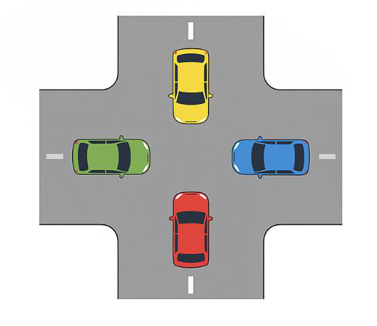
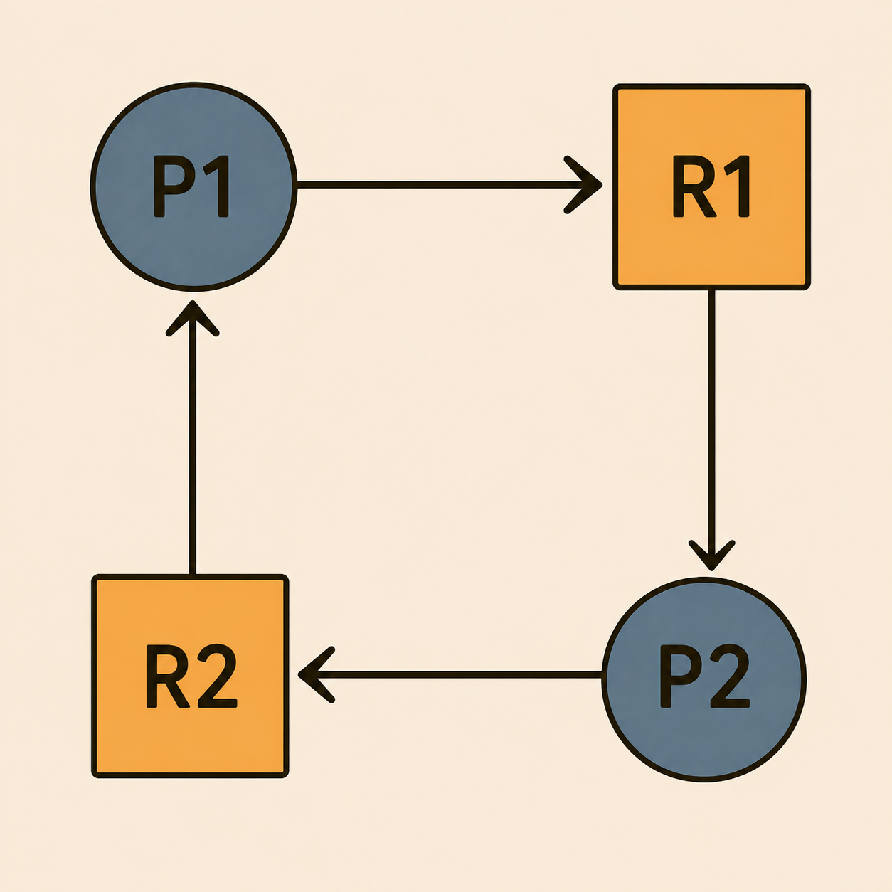
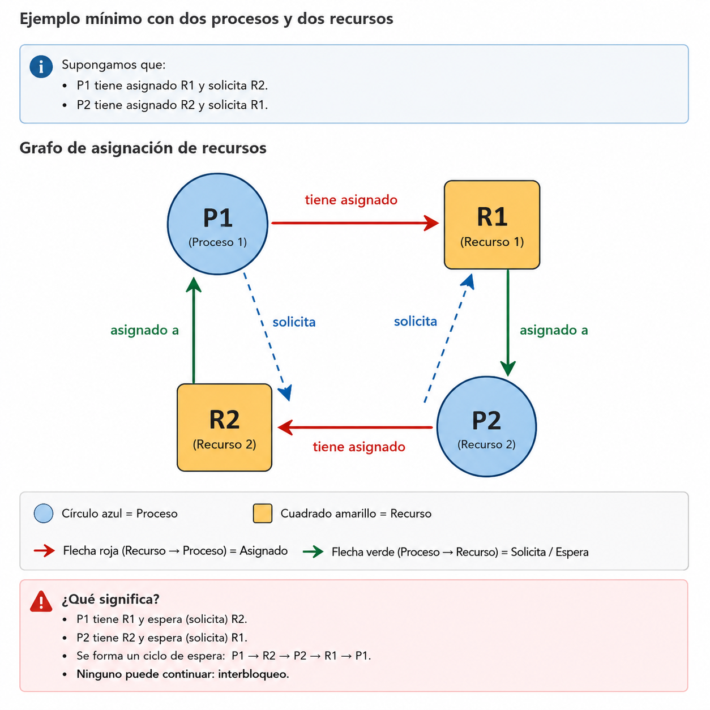
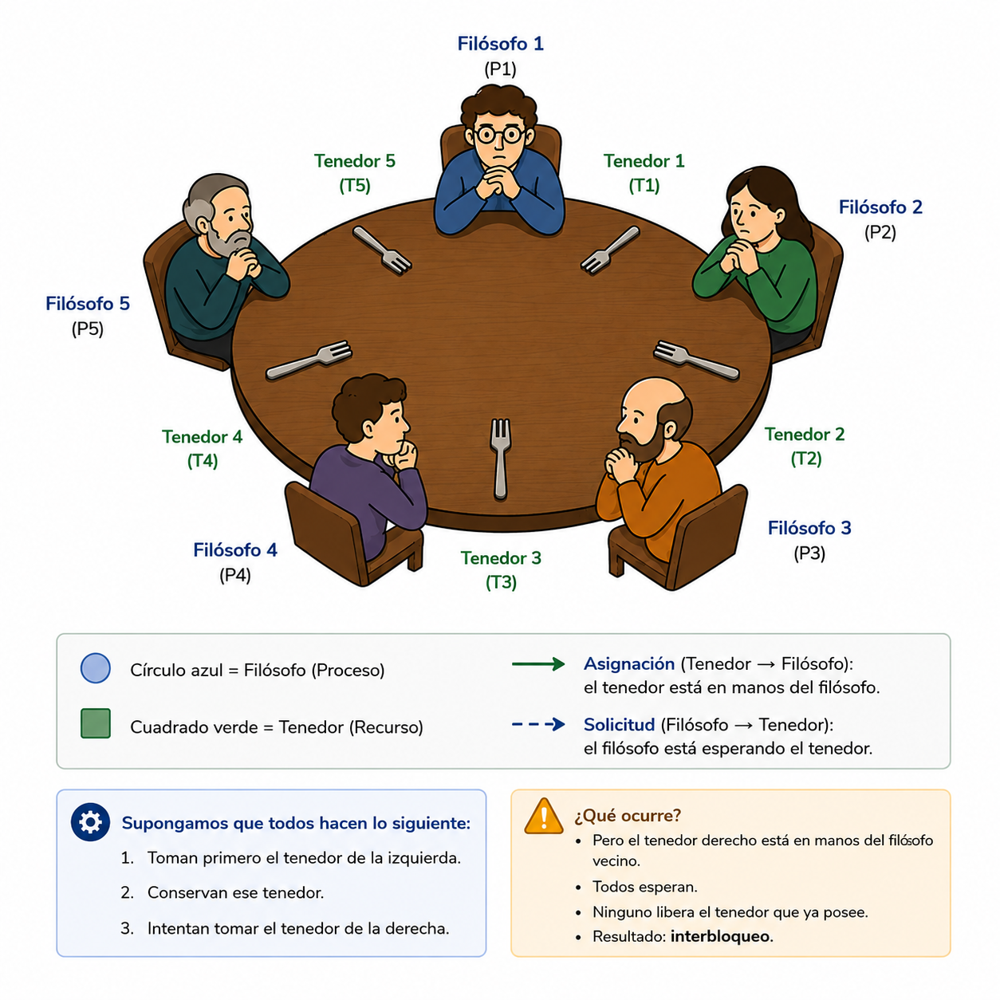
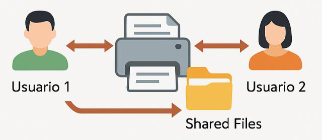
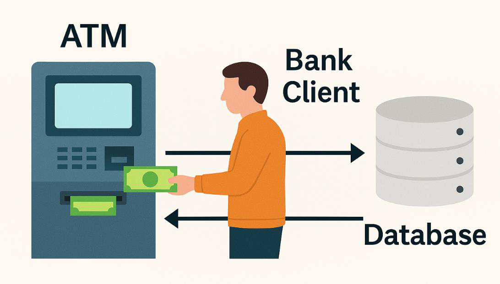

# Capítulo 8. Interbloqueos (Deadlocks)

## Relación con la clase anterior

En el capítulo anterior estudiamos que el **Kernel** administra los recursos del computador y coordina la ejecución de los procesos.

También vimos que múltiples procesos pueden necesitar al mismo tiempo recursos como:

- CPU.
- Memoria.
- Archivos.
- Dispositivos de entrada y salida.
- Impresoras.
- Recursos compartidos.

Ahora aparece una nueva pregunta:

> **¿Qué ocurre cuando dos o más procesos tienen recursos que otros necesitan y ninguno puede continuar?**

Ese problema recibe el nombre de **interbloqueo** o **deadlock**.

---

# Objetivos de aprendizaje

Al finalizar este capítulo serás capaz de:

- Comprender qué es un **interbloqueo (deadlock)**.
- Identificar los procesos y recursos involucrados en un interbloqueo.
- Reconocer las **cuatro condiciones necesarias** para que ocurra.
- Diferenciar recursos exclusivos y recursos compartidos.
- Analizar situaciones reales y computacionales donde se produce un interbloqueo.
- Proponer formas sencillas de evitar o romper una situación de bloqueo mutuo.

---

# Motivación

Imagina una intersección sin semáforo.

Cuatro vehículos llegan al mismo tiempo y cada uno avanza lo suficiente para impedir el paso del siguiente.

Nadie puede retroceder.

Nadie puede avanzar.

Todos están esperando que otro se mueva primero.

{fig-alt="Cuatro vehículos bloqueados en una intersección" width=55%}

::: {.callout-note}
## Pregunta detonadora

Si todos los procesos están esperando, ¿quién será el primero en liberar el recurso que los demás necesitan?
:::

Esta idea aparentemente sencilla nos permitirá comprender uno de los problemas clásicos de los sistemas concurrentes.

---

# ¿Qué es un interbloqueo?

Un **interbloqueo (deadlock)** ocurre cuando dos o más procesos permanecen esperando indefinidamente por recursos que no pueden obtener porque están retenidos por otros procesos que también se encuentran esperando.

En otras palabras:

> **Cada proceso espera algo que otro proceso posee, y ninguno puede continuar.**

El resultado es un **bloqueo mutuo**.

Los procesos involucrados no avanzan, aunque el sistema operativo continúe funcionando.

---

# Un ejemplo mínimo con dos procesos

Supongamos que existen:

- **Proceso P1**
- **Proceso P2**
- **Recurso R1**
- **Recurso R2**

La secuencia es la siguiente:

1. P1 obtiene R1.
2. P2 obtiene R2.
3. P1 solicita R2 y debe esperar.
4. P2 solicita R1 y también debe esperar.

{fig-alt="Diagrama de dos procesos y dos recursos en interbloqueo" width=58%}

Ninguno puede continuar.

```text
P1 tiene R1 y espera R2
P2 tiene R2 y espera R1
```

::: {.callout-warning}
## El problema

P1 no libera R1 porque todavía necesita terminar.

P2 no libera R2 por la misma razón.

Ambos esperan indefinidamente.
:::

---

# Las cuatro condiciones necesarias

Para que pueda existir un interbloqueo deben presentarse **simultáneamente cuatro condiciones**.

## 1. Exclusión mutua

Al menos un recurso debe estar disponible para **un solo proceso a la vez**.

Ejemplos:

- Una impresora.
- Un archivo abierto exclusivamente para escritura.
- Un escáner.
- Un bloqueo de base de datos.

Si un proceso está utilizando ese recurso, otro proceso debe esperar.

---

# 2. Retención y espera

Un proceso conserva uno o más recursos mientras espera obtener otros.

Ejemplo:

```text
P1 tiene R1
P1 espera R2
```

P1 no libera R1 mientras intenta obtener R2.

Esta combinación de **tener** y **esperar** es fundamental para que aparezca el problema.

---

# 3. No expropiación

El Sistema Operativo no puede retirar arbitrariamente un recurso que ya fue asignado a un proceso.

El proceso debe:

- utilizarlo,
- terminar su operación,
- y liberarlo voluntariamente.

::: {.callout-note}
## Ejemplo

Si un proceso está escribiendo en un archivo, retirarle el recurso en cualquier momento podría dejar la información inconsistente.
:::

---

# 4. Espera circular

Existe un ciclo en el cual cada proceso espera un recurso retenido por el siguiente proceso.

Por ejemplo:

```text
P1 espera un recurso de P2
P2 espera un recurso de P3
P3 espera un recurso de P1
```

En el caso más simple:

```text
P1 espera R2
P2 espera R1
```

{fig-alt="Ciclo de espera que representa un interbloqueo" width=58%}

La espera circular cierra el ciclo y evita que alguno de los procesos pueda avanzar.

---

# Idea clave: deben cumplirse las cuatro

Un interbloqueo requiere que las cuatro condiciones existan al mismo tiempo:

| Condición | Pregunta para identificarla |
|---|---|
| Exclusión mutua | ¿Hay un recurso que solo puede usar un proceso a la vez? |
| Retención y espera | ¿Algún proceso conserva un recurso mientras espera otro? |
| No expropiación | ¿El recurso no puede retirarse por la fuerza? |
| Espera circular | ¿Existe un ciclo de procesos esperando recursos entre sí? |

::: {.callout-tip}
## Regla para recordar

Si logramos eliminar **al menos una** de estas condiciones, el interbloqueo no puede formarse de esa manera.
:::

---

# Tipos de recursos

No todos los recursos se comportan igual.

## Recursos exclusivos

Solo un proceso puede utilizarlos en un momento determinado.

Ejemplos:

- Impresora.
- Escáner.
- Archivo con bloqueo exclusivo.
- Sección crítica protegida por un mutex.

Estos recursos son especialmente importantes cuando estudiamos interbloqueos.

## Recursos compartidos

Pueden ser utilizados por varios procesos, dependiendo de las reglas de acceso.

Ejemplos:

- Memoria compartida.
- Datos de solo lectura.
- Algunos recursos del sistema con acceso concurrente controlado.

::: {.callout-note}
## Importante

Los interbloqueos aparecen con mayor frecuencia cuando existen **recursos de uso exclusivo** y varios procesos compiten por ellos.
:::

---

# ¿Qué componentes del Sistema Operativo están implicados?

Los interbloqueos aparecen dentro del mismo entorno que hemos venido estudiando.

Participan principalmente:

- **Procesos o hilos**, que solicitan recursos.
- **Gestor de recursos**, que administra memoria, archivos y dispositivos.
- **Kernel**, que coordina la asignación y liberación.
- **Mecanismos de sincronización**, como semáforos y mutex.
- **Dispositivos y recursos de E/S**, que pueden estar ocupados por un proceso.

Esto conecta directamente los interbloqueos con los temas de:

- procesos,
- concurrencia,
- sincronización,
- administración de recursos.

---

# Ejemplo real: cruce vehicular

Regresemos al ejemplo de la intersección.

{fig-alt="Cruce vehicular con cuatro automóviles bloqueados" width=50%}

Podemos hacer la siguiente analogía:

| Situación real | Sistema Operativo |
|---|---|
| Cada vehículo | Un proceso |
| Espacio de la intersección | Un recurso |
| Vehículo esperando avanzar | Proceso esperando un recurso |
| Ningún vehículo se mueve | Ningún proceso avanza |

Cada vehículo ocupa una parte de la intersección y necesita el siguiente espacio para continuar.

Se forma un ciclo:

```text
Auto A espera a B
Auto B espera a C
Auto C espera a D
Auto D espera a A
```

Eso es exactamente una **espera circular**.

---

# Ejemplo clásico: filósofos comensales

Cinco filósofos se sientan alrededor de una mesa.

Entre cada par de filósofos existe un tenedor.

Para comer, cada filósofo necesita **dos tenedores**:

- uno a la izquierda,
- uno a la derecha.

{fig-alt="Cinco filósofos sentados alrededor de una mesa con tenedores" width=82%}

---

# Analizando a los filósofos con las cuatro condiciones

| Condición | ¿Cómo aparece? |
|---|---|
| Exclusión mutua | Cada tenedor solo puede estar en manos de un filósofo |
| Retención y espera | Cada filósofo conserva un tenedor y espera otro |
| No expropiación | No se le quita el tenedor por la fuerza |
| Espera circular | Cada filósofo espera el tenedor del vecino |

El ejemplo es útil porque permite visualizar las cuatro condiciones en una sola situación.

---

# Ejemplo adicional: impresoras en red

Dos usuarios necesitan utilizar:

- una impresora,
- y un conjunto de archivos compartidos.

{fig-alt="Usuarios, impresora y archivos compartidos" width=58%}

Supongamos que ocurre lo siguiente:

- Usuario 1 obtiene la impresora y espera los archivos.
- Usuario 2 obtiene los archivos y espera la impresora.

Entonces:

```text
Usuario 1 → espera archivos
Usuario 2 → espera impresora
```

Se forma un ciclo de espera mutua.

## ¿Cómo podría evitarse?

Dos ideas sencillas son:

- establecer un orden obligatorio para solicitar recursos,
- liberar un recurso antes de solicitar otro.

---

# Ejemplo adicional: software de oficina

Dos aplicaciones intentan trabajar con recursos que necesitan simultáneamente.

Por ejemplo:

- Aplicación A tiene bloqueado un archivo y espera memoria.
- Aplicación B tiene reservada memoria y espera el archivo.

La situación puede representarse así:

```text
Aplicación A: tiene Archivo → espera Memoria
Aplicación B: tiene Memoria → espera Archivo
```

De nuevo aparece la espera circular.

::: {.callout-tip}
## Pregunta para analizar

¿Cuáles de las cuatro condiciones puedes identificar en este escenario?
:::

---

# Ejemplo adicional: cajero automático

Un cajero automático necesita comunicarse con varios recursos mientras procesa una transacción.

Entre ellos:

- conexión con el cliente,
- base de datos bancaria,
- sistema de autorización,
- dispositivo dispensador.

{fig-alt="Cajero automático conectado a una base de datos" width=60%}

Si una operación retiene un recurso y espera otro que está bloqueado por una segunda operación, puede formarse una espera mutua.

Una estrategia mencionada en el material es:

- liberar recursos cuando una transacción falla,
- o utilizar temporizadores para evitar esperas indefinidas.

---

# Actividad en clase: identifiquemos el interbloqueo

Formen grupos y analicen el siguiente escenario:

> **Proceso A tiene la impresora y solicita acceso a la base de datos.  
> Proceso B tiene la base de datos y solicita la impresora.**

Respondan:

1. ¿Qué recurso tiene el Proceso A?
2. ¿Qué recurso espera?
3. ¿Qué recurso tiene el Proceso B?
4. ¿Qué recurso espera?
5. ¿Se cumplen las cuatro condiciones de interbloqueo?
6. Dibujen el ciclo de espera.

---

# Actividades por grupos

## Grupo 1. Cruce vehicular

Dibujen una intersección con cuatro autos sin semáforo.

Identifiquen:

- Qué recurso tiene cada auto.
- Qué recurso espera.
- Dónde está la espera circular.

## Grupo 2. Filósofos comensales

Analicen el problema clásico.

Respondan:

1. ¿Qué representa cada filósofo?
2. ¿Qué representan los tenedores?
3. ¿Cómo podría evitarse el interbloqueo?

## Grupo 3. Las cuatro condiciones

Utilicen el escenario de la impresora y la base de datos.

Identifiquen:

1. Exclusión mutua.
2. Retención y espera.
3. No expropiación.
4. Espera circular.

## Grupo 4. Clasificación de recursos

Clasifiquen como **exclusivos** o **compartidos**:

- Impresora.
- Archivo.
- CPU.
- Memoria compartida.
- Escáner.
- Variables globales.

## Grupo 5. Una historia de interbloqueo

Inventen una historia con:

- 2 personas,
- 2 recursos,
- una situación de bloqueo mutuo.

Luego indiquen:

- quiénes representan los procesos,
- cuáles son los recursos,
- y cómo podría evitarse.

## Grupo 6. Semáforo lógico

Simulen cómo un **semáforo** o un **árbitro** podría evitar:

- el interbloqueo del cruce,
- o el interbloqueo de los filósofos.

Respondan:

> ¿Qué condición deja de cumplirse cuando existe ese mecanismo de control?

---

# Soluciones para discusión

Esta sección puede utilizarse después de que los grupos presenten sus respuestas.

## Grupo 1

Cada automóvil ocupa un espacio y espera el siguiente.

Se forma un ciclo:

```text
A → B → C → D → A
```

## Grupo 2

- Filósofos → procesos.
- Tenedores → recursos exclusivos.
- Posibles soluciones: tomar ambos tenedores a la vez, limitar cuántos intentan comer o utilizar un árbitro.

## Grupo 3

Se cumplen:

1. Exclusión mutua.
2. Retención y espera.
3. No expropiación.
4. Espera circular.

## Grupo 4

De acuerdo con la clasificación planteada en el material de clase:

- **Exclusivos:** impresora, archivo, CPU, escáner.
- **Compartidos:** memoria compartida, variables globales.

## Grupo 5

Ejemplo del material:

> Ana utiliza el microondas y espera el cuchillo. Carlos tiene el cuchillo y espera el microondas.

Una forma de evitarlo es liberar un recurso antes de solicitar otro o imponer un orden de solicitud.

## Grupo 6

El semáforo o árbitro controla el acceso y evita que todos entren simultáneamente en una situación de espera circular.

---

# ¿Cómo evitar un interbloqueo?

En esta clase no estudiaremos todavía los algoritmos formales de prevención y detección.

Sin embargo, los ejemplos ya nos permiten anticipar varias ideas:

- Solicitar recursos en un orden definido.
- Evitar conservar recursos mientras se esperan otros.
- Limitar cuántos procesos compiten al mismo tiempo.
- Liberar recursos cuando una operación falla.
- Utilizar un árbitro o mecanismo de coordinación.
- Establecer tiempos máximos de espera en determinados escenarios.

::: {.callout-warning}
## Importante

Estas ideas introducen el siguiente tema.

En el próximo capítulo estudiaremos estrategias formales para **prevenir, evitar, detectar y recuperar** interbloqueos.
:::

---

# Caso integrador

Supongamos que un sistema tiene dos procesos:

```text
P1 necesita: Impresora + Archivo
P2 necesita: Archivo + Impresora
```

La ejecución ocurre así:

```text
1. P1 obtiene la impresora.
2. P2 obtiene el archivo.
3. P1 solicita el archivo.
4. P2 solicita la impresora.
```

Analicemos:

| Pregunta | Respuesta |
|---|---|
| ¿P1 puede continuar? | No |
| ¿P2 puede continuar? | No |
| ¿P1 libera la impresora? | No mientras espera terminar |
| ¿P2 libera el archivo? | No mientras espera terminar |
| ¿Existe espera circular? | Sí |
| ¿Existe interbloqueo? | Sí |

Este pequeño ejemplo contiene la esencia del problema completo.

---

# Autoevaluación

1. ¿Qué es un interbloqueo?
2. ¿Qué diferencia existe entre un proceso bloqueado temporalmente y un proceso en interbloqueo?
3. ¿Cuáles son las cuatro condiciones necesarias?
4. Explica con tus palabras la exclusión mutua.
5. ¿Qué significa retención y espera?
6. ¿Por qué la no expropiación favorece un interbloqueo?
7. ¿Qué representa la espera circular?
8. ¿Por qué el cruce vehicular es una buena analogía?
9. En los filósofos comensales, ¿qué representan los filósofos y los tenedores?
10. ¿Qué relación existe entre los interbloqueos y la administración de recursos del Kernel?
11. Construye un ejemplo con dos procesos y dos recursos.
12. Propón una forma sencilla de romper una de las cuatro condiciones.

---

# Resumen del capítulo

Durante este capítulo aprendimos que un **interbloqueo** ocurre cuando varios procesos quedan esperando recursos retenidos entre sí y ninguno puede avanzar.

Para que aparezca deben coincidir cuatro condiciones:

1. **Exclusión mutua.**
2. **Retención y espera.**
3. **No expropiación.**
4. **Espera circular.**

También analizamos ejemplos como:

- cruce vehicular,
- filósofos comensales,
- impresoras en red,
- aplicaciones de oficina,
- cajeros automáticos.

::: {.callout-note}
## Para recordar

Un proceso esperando no implica necesariamente un interbloqueo.

El problema aparece cuando existe una **dependencia mutua que impide el avance de todos los procesos involucrados**.
:::

---

# Conexión con el siguiente capítulo

Ya sabemos reconocer **cuándo** existe un interbloqueo y **qué condiciones** permiten que ocurra.

La siguiente pregunta será:

> **¿Qué puede hacer el Sistema Operativo para impedirlo o resolverlo?**

En el siguiente capítulo estudiaremos:

- Prevención de interbloqueos.
- Evitación.
- Detección.
- Recuperación.
- Algoritmos utilizados para analizar estados seguros e inseguros.

---

# Bibliografía base

El material de clase propone como referencias:

- Tanenbaum, capítulo 7.1.
- Deitel, capítulo 5.1.
