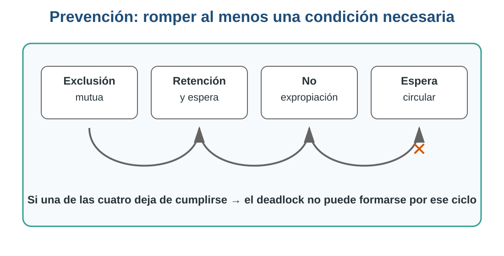
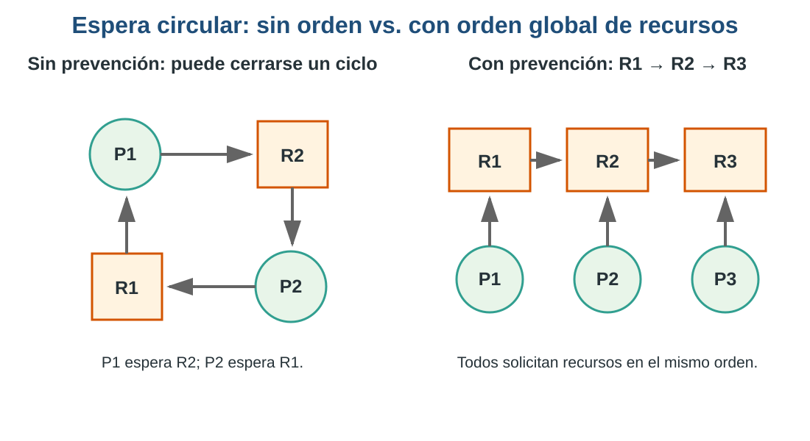
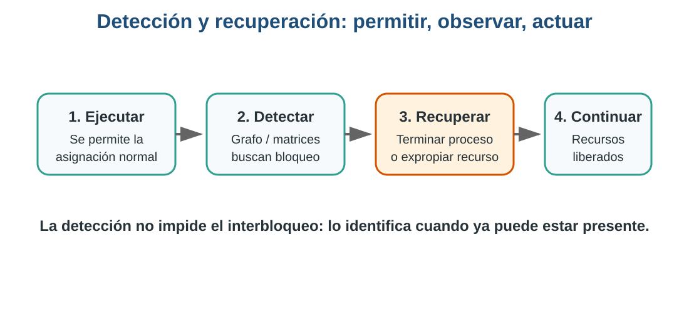

## Relación con la clase anterior

En el capítulo anterior aprendimos a reconocer un **interbloqueo (deadlock)** y estudiamos las cuatro condiciones necesarias para que pueda aparecer:

1. Exclusión mutua.
2. Retención y espera.
3. No expropiación.
4. Espera circular.

También analizamos casos con procesos que conservan recursos mientras esperan otros. Ahora damos el siguiente paso:

> **Si ya sabemos cómo se forma un interbloqueo, ¿qué puede hacer el Sistema Operativo para impedirlo, detectarlo o recuperarse cuando ya ocurrió?**

---

# Objetivos de aprendizaje

Al finalizar este capítulo serás capaz de:

- Explicar cómo se **previenen** interbloqueos rompiendo al menos una condición necesaria.
- Analizar las ventajas y desventajas de distintas políticas de prevención.
- Interpretar un **grafo de asignación de recursos** para identificar ciclos de espera.
- Diferenciar **prevención, evitación, detección y recuperación**.
- Comprender la idea de **estado seguro** y la lógica general del algoritmo del banquero.
- Proponer una estrategia de recuperación ante un interbloqueo sencillo.

---

# 1. Recordemos antes de avanzar

::: {.callout-note}
## Pregunta para el grupo

Sin consultar el capítulo anterior:

**¿Cuáles son las cuatro condiciones que deben cumplirse simultáneamente para que exista un interbloqueo?**
:::

| Condición | Idea principal |
|---|---|
| Exclusión mutua | Un recurso solo puede ser utilizado por un proceso a la vez |
| Retención y espera | Un proceso conserva recursos mientras solicita otros |
| No expropiación | Un recurso no puede retirarse arbitrariamente |
| Espera circular | Existe un ciclo de procesos esperando recursos entre sí |

La idea central de la **prevención** es sencilla:

> Si evitamos que al menos una de estas condiciones pueda cumplirse, rompemos la posibilidad de formar ese interbloqueo.

{fig-alt="Las cuatro condiciones necesarias y la idea de romper una de ellas para prevenir un interbloqueo" width="92%"}

---

# 2. ¿Por qué prevenir interbloqueos?

Un interbloqueo puede provocar que procesos permanezcan detenidos indefinidamente.

Algunos efectos posibles son:

- documentos que nunca llegan a imprimirse;
- transacciones que no pueden continuar;
- recursos ocupados sin realizar trabajo útil;
- usuarios esperando operaciones que no terminan;
- pérdida de rendimiento y disponibilidad.

En sistemas críticos —por ejemplo, bancos, hospitales o sistemas de control— el comportamiento debe ser especialmente predecible.

::: {.callout-important}
## Pensemos

¿Siempre conviene prevenir un interbloqueo a cualquier costo?

Una política muy restrictiva puede evitar deadlocks, pero también puede dejar recursos sin utilizar durante mucho tiempo.
:::

---

# 3. Prevención: atacar las condiciones necesarias

## 3.1 Exclusión mutua

La exclusión mutua existe cuando un recurso no puede compartirse simultáneamente.

Una estrategia consiste en **hacer compartibles los recursos siempre que sea posible**.

Ejemplo:

- varios procesos pueden leer simultáneamente un archivo de solo lectura;
- pero no siempre es posible compartir una impresora durante la impresión física de un documento.

::: {.callout-warning}
## Limitación

No podemos eliminar la exclusión mutua de todos los recursos. Algunos son inherentemente exclusivos.
:::

### Mini ejercicio

Clasifica estos recursos como **potencialmente compartibles** o **normalmente exclusivos**:

1. Archivo de solo lectura.
2. Impresora.
3. Base de datos con múltiples lectores.
4. Escáner.

::: {.callout-tip collapse="true"}
## ✅ Ver solución

1. **Archivo de solo lectura → Potencialmente compartible.** Varios procesos pueden leerlo simultáneamente sin modificar su contenido.
2. **Impresora → Normalmente exclusiva.** Los trabajos deben coordinarse para evitar que varias salidas se mezclen.
3. **Base de datos con múltiples lectores → Potencialmente compartible.** Varias lecturas pueden realizarse simultáneamente; las escrituras requieren mecanismos de sincronización.
4. **Escáner → Normalmente exclusivo.** Una operación de captura suele ser controlada por un proceso a la vez.

**Idea clave:** si un recurso puede compartirse de forma segura, la exclusión mutua deja de ser necesaria para ese recurso.
:::

---

# 4. Prevención de retención y espera

## ¿Qué ocurre?

Un proceso ya posee un recurso y solicita otro sin liberar el primero.

Ejemplo:

```text
P1 tiene Impresora
P1 solicita Disco
```

Si el disco está ocupado, P1 queda esperando mientras conserva la impresora.

## ¿Cómo podemos prevenirlo?

Una política posible es exigir que el proceso:

- solicite **todos los recursos que necesitará al inicio**, o
- no pueda solicitar nuevos recursos mientras conserve otros.

Si no obtiene todos los recursos necesarios, espera sin conservar parcialmente el conjunto.

### Ventaja

Reduce la posibilidad de que se formen cadenas de procesos reteniendo recursos.

### Desventaja

Puede disminuir el aprovechamiento de recursos.

Un proceso podría reservar una impresora desde el inicio aunque no la utilice hasta mucho después.

::: {.callout-note}
## Pregunta

¿Qué preferimos: máxima seguridad contra interbloqueos o máximo aprovechamiento de recursos?

Esta tensión aparecerá varias veces en Sistemas Operativos.
:::

---

# 5. Prevención mediante expropiación

La condición de **no expropiación** establece que un recurso asignado no puede retirarse por la fuerza.

Para romper esa condición, el Sistema Operativo puede permitir que ciertos recursos sean recuperados y reasignados.

Ejemplo conceptual:

```text
P1 posee R1
P1 solicita R2 y queda bloqueado
SO recupera R1
R1 puede ser utilizado por otro proceso
```

## El problema

No todos los recursos pueden expropiarse de forma segura.

Quitar memoria o determinados recursos puede ser viable si existe un mecanismo de recuperación; interrumpir una escritura crítica o retirar una impresora a mitad de una operación puede dejar resultados inconsistentes.

::: {.callout-warning}
## Idea clave

La expropiación requiere una política para decidir:

- qué recurso retirar;
- a qué proceso;
- cómo recuperar posteriormente su estado.
:::

---

# 6. Prevención de espera circular

La espera circular puede evitarse imponiendo un **orden total a los recursos**.

Supongamos:

```text
R1 = Memoria
R2 = Disco
R3 = Impresora
```

La regla será:

```text
R1 → R2 → R3
```

Todo proceso deberá solicitar recursos respetando ese orden.

{fig-alt="Comparación entre una espera circular y una política de orden global de recursos" width="94%"}

Si todos siguen el mismo orden, un proceso no puede solicitar un recurso anterior después de haber obtenido uno posterior. Esto impide cerrar el ciclo de espera.

### Ejercicio rápido

Un sistema define:

```text
R1 = Archivo
R2 = Base de datos
R3 = Impresora
```

Analiza estas solicitudes:

```text
P1: R1 → R2
P2: R2 → R3
P3: R3 → R1
```

1. ¿Qué proceso viola el orden establecido?
2. ¿Qué podría ocurrir si permitimos esa solicitud?
3. ¿Cómo debería solicitar P3 sus recursos?

::: {.callout-tip collapse="true"}
## ✅ Ver solución

El orden global establecido es **R1 → R2 → R3**.

- **P1: R1 → R2**: respeta el orden.
- **P2: R2 → R3**: respeta el orden.
- **P3: R3 → R1**: **viola el orden**, porque después de R3 intenta solicitar un recurso anterior.

Si permitimos esa solicitud puede cerrarse una cadena circular entre procesos y recursos, creando las condiciones para un interbloqueo.

P3 debería solicitar sus recursos en orden ascendente: **R1 → R3**, y no **R3 → R1**.

**Idea clave:** imponer un orden global rompe la condición de **espera circular**.
:::

---

# 7. Prevención, evitación y detección no son lo mismo

| Estrategia | Idea |
|---|---|
| Prevención | Diseñar reglas para que alguna condición necesaria no pueda cumplirse |
| Evitación | Evaluar cada asignación y concederla solo si el sistema permanece en un estado seguro |
| Detección | Permitir la ejecución y buscar posteriormente si apareció un interbloqueo |
| Recuperación | Tomar acciones después de detectar el interbloqueo |

::: {.callout-tip}
## Precisión importante

El material de clase introduce el **algoritmo del banquero** dentro de las estrategias para impedir interbloqueos. Técnicamente, suele clasificarse como un algoritmo de **evitación**, porque no elimina permanentemente una condición: analiza si conceder una solicitud mantiene al sistema en un estado seguro.
:::

---

# 8. Detección de interbloqueos

En la detección, el sistema **no impide necesariamente** que se forme un interbloqueo.

En cambio:

1. permite que los procesos soliciten y reciban recursos;
2. analiza periódicamente el estado del sistema;
3. busca dependencias que indiquen bloqueo;
4. si encuentra un interbloqueo, inicia una estrategia de recuperación.

{fig-alt="Flujo conceptual de detección y recuperación de un interbloqueo" width="92%"}

---

# 9. Grafo de asignación de recursos

Un grafo de asignación representa:

- **procesos** mediante círculos;
- **recursos** mediante cuadros;
- `P → R` cuando un proceso solicita un recurso;
- `R → P` cuando un recurso está asignado a un proceso.

Ejemplo:

```text
P1 → R2
R2 → P2
P2 → R3
R3 → P1
```

La cadena vuelve a P1:

```text
P1 → R2 → P2 → R3 → P1
```

Existe un ciclo.

::: {.callout-note}
## Importante

En el caso simple donde cada tipo de recurso tiene una sola instancia, un ciclo confirma el interbloqueo. Con múltiples instancias, la interpretación requiere un análisis adicional.
:::

## Practiquemos

Analiza:

```text
R1 → P1
P1 → R2
R2 → P2
P2 → R1
```

Responde:

1. ¿Qué recurso posee P1?
2. ¿Qué recurso solicita P1?
3. ¿Qué recurso posee P2?
4. ¿Qué recurso solicita P2?
5. ¿Existe un ciclo?
6. ¿Existe interbloqueo en este caso?

::: {.callout-tip collapse="true"}
## ✅ Ver solución

1. P1 posee **R1**.
2. P1 solicita **R2**.
3. P2 posee **R2**.
4. P2 solicita **R1**.
5. Sí existe un ciclo: **R1 → P1 → R2 → P2 → R1**.
6. Si R1 y R2 tienen **una sola instancia cada uno**, sí existe interbloqueo: P1 espera R2, que posee P2, mientras P2 espera R1, que posee P1.

**Importante:** con una sola instancia por tipo de recurso, el ciclo confirma el interbloqueo. Con múltiples instancias se necesita un análisis adicional.
:::

---

# 10. El algoritmo del banquero

El algoritmo del banquero fue propuesto por **Edsger Dijkstra**.

Su idea puede imaginarse como un banco que presta dinero:

> El banco no concede un préstamo únicamente porque tenga dinero disponible en este instante. Antes debe comprobar que, después del préstamo, todavía existe una forma de satisfacer a todos sus clientes.

En Sistemas Operativos:

- los clientes son **procesos**;
- el dinero representa **recursos**;
- cada proceso declara su necesidad máxima;
- el sistema analiza si una asignación mantiene un **estado seguro**.

---

# 11. ¿Qué es un estado seguro?

Un estado es **seguro** cuando existe al menos una secuencia de ejecución en la cual todos los procesos pueden terminar.

Supongamos tres procesos:

```text
P1
P2
P3
```

Si existe una secuencia como:

```text
P2 → P1 → P3
```

en la cual P2 puede terminar con los recursos disponibles, liberar los suyos, luego P1 puede terminar y finalmente P3, entonces tenemos una **secuencia segura**.

::: {.callout-important}
## Estado inseguro ≠ interbloqueo actual

Un estado inseguro significa que el sistema ya no puede garantizar una secuencia segura.

No significa necesariamente que el interbloqueo ya ocurrió, pero existe riesgo de llegar a él.
:::

---

# 12. Ejemplo básico del banquero

Consideremos un solo tipo de recurso para comprender primero la lógica.

El sistema tiene **10 unidades**.

| Proceso | Asignado | Máximo | Necesita todavía |
|---|---:|---:|---:|
| P1 | 3 | 7 | 4 |
| P2 | 2 | 4 | 2 |
| P3 | 2 | 5 | 3 |

Recursos utilizados:

```text
3 + 2 + 2 = 7
```

Recursos disponibles:

```text
10 - 7 = 3
```

Preguntemos:

> ¿Existe algún proceso que pueda terminar necesitando como máximo las 3 unidades disponibles?

P2 necesita 2.

Entonces:

1. P2 recibe lo necesario y termina.
2. Libera sus recursos.
3. Ahora existen más recursos disponibles.
4. Buscamos otro proceso que pueda terminar.
5. Repetimos hasta completar todos los procesos.

::: {.callout-note}
## Ejercicio guiado

Continúa el ejemplo:

1. Después de que P2 termina, ¿cuántos recursos quedan disponibles?
2. ¿Puede terminar P1?
3. ¿Puede terminar P3?
4. Escribe una posible secuencia segura.
:::

::: {.callout-tip collapse="true"}
## ✅ Ver solución

Inicialmente hay **3 recursos disponibles**.

- P2 necesita 2, por lo que puede recibirlos y terminar.
- Al terminar P2 libera sus **4 recursos** en total (los 2 que tenía más los 2 que recibió). Como antes de atenderlo había 3 disponibles, después quedan **5 disponibles**.
- P1 necesita 4, así que ahora puede terminar. Al liberar sus 7 recursos, quedan **10 disponibles**.
- Finalmente P3, que necesita 3, también puede terminar.

Una secuencia segura posible es:

**P2 → P1 → P3**

También puede existir otra secuencia segura; lo importante es demostrar que existe al menos una en la que todos los procesos puedan finalizar.
:::

---

# 13. Actividad por pares: ¿cómo lo resolverías?

Analicen:

```text
Proceso A tiene Disco y solicita Memoria.
Proceso B tiene Memoria y solicita Disco.
```

Respondan:

1. ¿Qué condiciones de interbloqueo se cumplen?
2. ¿Existe espera circular?
3. ¿Qué política de prevención podría evitar el problema?
4. Si el interbloqueo ya ocurrió, ¿qué recurso podría intentarse recuperar?
5. ¿Qué riesgo tendría expropiar un recurso?

Tiempo sugerido: **5 minutos**.

::: {.callout-tip collapse="true"}
## ✅ Ver solución

1. **Se cumplen las cuatro condiciones:** exclusión mutua, retención y espera, no expropiación y espera circular.
2. **Sí existe espera circular:** A espera Memoria, que posee B; B espera Disco, que posee A.
3. Una política sencilla sería imponer un **orden global de recursos**, por ejemplo: **Disco → Memoria**. Todos los procesos que necesiten ambos deberán solicitarlos en ese orden.
4. Si el interbloqueo ya ocurrió, podría intentarse recuperar uno de los recursos **solo si puede expropiarse de forma segura**. Otra alternativa es finalizar o reiniciar uno de los procesos para que libere lo que posee.
5. Expropiar un recurso puede dejar al proceso en un estado inconsistente, provocar pérdida de trabajo o exigir repetir operaciones.

**Conclusión:** prevenir el ciclo suele ser menos costoso que recuperarse después de que el interbloqueo ya ocurrió.
:::

---

# 14. Recuperación después del interbloqueo

Si el interbloqueo ya existe, prevenirlo dejó de ser una opción. Debemos recuperarnos.

Dos estrategias comunes son:

## Finalizar procesos

El Sistema Operativo puede:

- terminar todos los procesos involucrados, o
- terminar procesos uno por uno hasta romper el ciclo.

## Retirar recursos selectivamente

El sistema puede intentar expropiar un recurso y reasignarlo.

Para elegir una **víctima** deben considerarse factores como:

- prioridad del proceso;
- tiempo que lleva ejecutándose;
- cantidad de trabajo realizado;
- recursos que posee;
- costo de reiniciarlo;
- riesgo de pérdida o inconsistencia de datos.

---

# 15. Caso integrador

Un servidor tiene:

```text
P1: posee Archivo A y solicita Impresora
P2: posee Impresora y solicita Archivo A
```

Trabajemos en cuatro niveles.

## Nivel 1. Diagnóstico

- ¿Existe interbloqueo?
- ¿Cuáles condiciones se cumplen?

## Nivel 2. Prevención

- ¿Qué condición podríamos romper?
- ¿Cómo impondríamos un orden de recursos?

## Nivel 3. Detección

Dibuja el grafo utilizando:

```text
Proceso → Recurso solicitado
Recurso → Proceso que lo posee
```

## Nivel 4. Recuperación

Si ya ocurrió:

- ¿terminarías P1 o P2?
- ¿intentarías retirar un recurso?
- ¿qué información necesitarías para decidir?

::: {.callout-tip collapse="true"}
## ✅ Ver solución

### Nivel 1. Diagnóstico

Sí existe interbloqueo, suponiendo que **Archivo A** y la **Impresora** son recursos exclusivos con una sola instancia. Se cumplen las cuatro condiciones: exclusión mutua, retención y espera, no expropiación y espera circular.

### Nivel 2. Prevención

Podemos romper la **espera circular** imponiendo un orden global, por ejemplo:

```text
Archivo A → Impresora
```

Todos los procesos que necesiten ambos recursos deberán solicitarlos en ese mismo orden.

### Nivel 3. Detección

El grafo contiene:

```text
Archivo A → P1
P1 → Impresora
Impresora → P2
P2 → Archivo A
```

Por tanto aparece el ciclo:

```text
Archivo A → P1 → Impresora → P2 → Archivo A
```

Con una sola instancia de cada recurso, el ciclo representa un interbloqueo.

### Nivel 4. Recuperación

No podemos decidir automáticamente si conviene terminar P1 o P2 únicamente con la información del enunciado. Para elegir una víctima deberíamos considerar, entre otros factores:

- prioridad de cada proceso;
- cantidad de trabajo realizado;
- costo de reiniciarlo;
- recursos que liberaría;
- consecuencias de cancelar la operación;
- posibilidad de repetir o recuperar el trabajo.

También podría intentarse expropiar un recurso si la operación permite hacerlo de manera segura.

**Idea clave:** detectar el interbloqueo no resuelve el problema por sí solo; la recuperación puede tener un costo importante.
:::

---

# 16. Actividad individual

Busca un caso real o documentado de interbloqueo en software.

Identifica:

1. ¿Qué procesos o hilos estaban involucrados?
2. ¿Qué recursos estaban utilizando?
3. ¿Cómo se produjo la espera?
4. ¿Cómo se detectó?
5. ¿Cómo se solucionó o evitó posteriormente?

::: {.callout-tip}
## No basta con encontrar el caso

Debes poder relacionarlo con al menos una de estas ideas:

**prevención – evitación – detección – recuperación**
:::

---

# 17. Autoevaluación

1. ¿Cuál es la idea fundamental de la prevención de interbloqueos?
2. ¿Cómo puede atacarse la condición de retención y espera?
3. ¿Qué desventaja tiene solicitar todos los recursos al inicio?
4. ¿Qué significa expropiar un recurso?
5. ¿Por qué algunos recursos no deberían expropiarse?
6. ¿Cómo evita un orden global de recursos la espera circular?
7. ¿Qué diferencia existe entre prevención y detección?
8. ¿Qué representa `P → R` en un grafo de asignación?
9. ¿Qué representa `R → P`?
10. ¿Qué es un estado seguro?
11. ¿Por qué el algoritmo del banquero se relaciona con la evitación?
12. ¿Qué alternativas existen para recuperarse de un interbloqueo?

---

# 18. Resumen del capítulo

En este capítulo aprendimos que no existe una única estrategia frente a los interbloqueos.

Podemos actuar **antes**, **durante** o **después** del problema:

```text
PREVENIR  → romper una condición necesaria
EVITAR    → conceder recursos solo si el estado continúa siendo seguro
DETECTAR  → buscar interbloqueos durante la ejecución
RECUPERAR → romper el bloqueo después de detectarlo
```

También estudiamos:

- retención y espera;
- expropiación;
- espera circular;
- grafos de asignación;
- estados seguros;
- algoritmo del banquero;
- finalización de procesos;
- recuperación de recursos.

::: {.callout-note}
## Para recordar

La mejor estrategia depende del tipo de sistema, del costo de mantener recursos reservados y de las consecuencias de detener o reiniciar procesos.
:::

---

# Conexión con la siguiente clase

Ya sabemos:

- cómo se forma un interbloqueo;
- cómo prevenirlo;
- cómo analizar estados seguros;
- cómo detectarlo;
- y qué opciones existen para recuperarse.

En la siguiente etapa podremos profundizar en la administración de recursos y en los mecanismos que utiliza el Sistema Operativo para coordinar procesos concurrentes.

---

# Bibliografía base

De acuerdo con el material de clase:

- Tanenbaum, secciones/capítulos 7.2–7.4 indicados en la presentación.
- Deitel, secciones/capítulos 5.2–5.4 indicados en la presentación.
- Capítulo anterior: **Condiciones necesarias de interbloqueo**.
